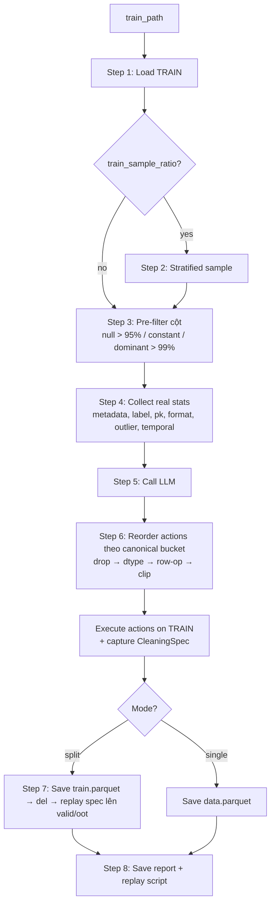

# Agent 1 — DataCleaner: Pipeline flow

> **Vai trò**: Audit chất lượng dữ liệu, drop cột rác, fix dtype, clip outlier, dedup. Capture mọi cột-level transform vào `CleaningSpec` để replay deterministic lên valid/oot.

## Entry points

| Mode | Function | Input |
|---|---|---|
| Split mode | `process_splits()` ([line 759](../Agents/DataCleaner/agent_data_cleaner.py#L759)) | `train_path` + tùy chọn `valid_path`, `oot_path` |
| Single mode | `process()` ([line 833](../Agents/DataCleaner/agent_data_cleaner.py#L833)) | 1 file đầu vào |

Cả 2 đều gọi `fit_transform()` ([line 692](../Agents/DataCleaner/agent_data_cleaner.py#L692)) cho TRAIN. Split mode sau đó replay spec lên valid/oot từng partition (memory profile = 1 partition tại 1 thời điểm).

---

## Step 0 — Setup ([line 79-95](../Agents/DataCleaner/agent_data_cleaner.py#L79-L95))

```
self._entity_id_col       ← từ constructor (override auto-detect)
self._composite_key_cols  ← từ constructor
self._target_column       ← từ constructor
self.tool_registry        ← register 12 tools
```

---

## Step 1 — Load TRAIN ([line 709-721](../Agents/DataCleaner/agent_data_cleaner.py#L709-L721))

```
self.df = BaseAgent.load_dataframe(train_path)
original_shape = self.df.shape
```

Hỗ trợ CSV, Parquet, Excel, JSON, Feather, ORC, S3 (auto-detect format + magic byte cho `.xls/.xlsx` đặt sai extension).

---

## Step 2 — Optional stratified sample ([line 714-721, 660-688](../Agents/DataCleaner/agent_data_cleaner.py#L714-L721))

Khi `train_sample_ratio ∈ (0, 1)`:

```
positions = _stratified_sample_positions(df, target_col, ratio)  ← seeded
self.df = self.df.iloc[positions].reset_index(drop=True)
```

- Stratify theo `target_column` (giữ class balance)
- Reproducible qua `Config.RANDOM_STATE`
- Chỉ áp lên TRAIN; valid/oot không bao giờ bị sample

---

## Step 3 — Pre-filter cột ([line 723-735, 632-658](../Agents/DataCleaner/agent_data_cleaner.py#L723-L735))

Khi `prefilter=True` (default), scan train + drop cột rõ ràng vô dụng (không gọi LLM):

| Tiêu chí | Threshold | Default |
|---|---|---|
| Null ratio cao | `> PREFILTER_MAX_NULL_RATIO` | 95% |
| Constant (nunique ≤ 1) | luôn drop | — |
| Dominant value | `top_count / non_null > PREFILTER_MAX_DOMINANT_RATIO` (chỉ check khi `nunique ≤ 1000`) | 99% |

Drop list được record vào `spec.drops` → replay deterministic xuống valid/oot.

**Protected cols** (entity_id ∪ composite_key ∪ target) không bao giờ bị drop.

---

## Step 4 — Collect real stats ([line 737-744](../Agents/DataCleaner/agent_data_cleaner.py#L737-L744))

Trước khi gọi LLM, compute stats THỰC từ data (không để LLM tự đoán):

| Stat function | Output |
|---|---|
| `_tool_inspect_metadata` | shape, dtypes, null counts, duplicate %, constant cols |
| `_collect_label_stats` | class distribution, imbalance ratio, null labels |
| `_collect_pk_stats` | exact/soft/app duplicates, composite key violations, entity resolution (CIF/phone/device/national_id) |
| `_tool_check_column_formats` | numeric-as-object, date-as-object, whitespace, mixed case |
| `_collect_outlier_stats` | IQR 3× outlier count (top `OUTLIER_NUMERIC_COLS_LIMIT=10` numeric cols) |
| `_collect_temporal_stats` | date range, future dates, leakage suspect column names |

Metadata được **compress** ([line 1177-1217](../Agents/DataCleaner/agent_data_cleaner.py#L1177-L1217)) trước khi đưa vào prompt — chỉ giữ cột có null > threshold + dtype histogram để tránh overflow context với dataset 500+ cột.

---

## Step 5 — Call LLM ([line 745-751](../Agents/DataCleaner/agent_data_cleaner.py#L745-L751))

```
prompt = build_analysis_prompt(metadata, format, outlier, label, temporal, pk)
response = call_llm(prompt, system_prompt, json_mode=True, max_tokens=LLM_MAX_TOKENS_LARGE)
```

LLM trả về JSON:
```json
{
    "reasoning": "...",
    "actions": [
        {"action": "drop_column",       "column": "...", "reason": "..."},
        {"action": "fix_column_dtype",  "column": "...", "fix_type": "cast_to_numeric", "reason": "..."},
        {"action": "clip_outliers",     "column": "...", "factor": 3.0, "reason": "..."},
        {"action": "drop_duplicates",   "reason": "..."},
        {"action": "deduplicate_by_key","columns": [...], "keep": "first", "reason": "..."}
    ]
}
```

---

## Step 6 — Execute LLM decisions ([line 1255-1356](../Agents/DataCleaner/agent_data_cleaner.py#L1255-L1356))

Actions được **reorder theo canonical bucket** trước khi execute ([`_ACTION_ORDER`](../Agents/DataCleaner/agent_data_cleaner.py#L1246-L1254)) để train match `CleaningSpec.apply()` trên valid/oot:

```
LLM order:  clip A → dtype B → drop C → clip D → dedup
After sort: drop C → dtype B → dedup → clip A → clip D
            └─bucket 0─┴─bucket 1─┴─bucket 2─┴───bucket 3───┘
```

Python stable sort giữ thứ tự LLM trong cùng bucket. Log "Action Reorder" chỉ xuất hiện khi thực sự cần reorder.

### 6 action types

| Action | Vào spec? | Guard |
|---|---|---|
| `drop_column` | `spec.drops` | Block nếu null_rate ≤ `NULL_DROP_THRESHOLD` AND not constant AND not all-unique (LLM không drop bừa). PK/composite/target protected. |
| `fix_column_dtype` | `spec.dtype_fixes` | PK/composite/target protected |
| `drop_duplicates` | ❌ row-op, train only | — |
| `deduplicate_by_key` | ❌ row-op, train only | Target không được làm dedup key |
| `clip_outliers` | `spec.clip_bounds` (Q1/Q3 từ train) | PK/composite/target protected |

Mỗi action có try/except riêng — 1 action fail không kill toàn pipeline.

Nếu LLM response không parse được → fallback `_fallback_cleaning` chỉ drop cột null > threshold.

---

## Step 7 — Save train + transform valid/oot (split mode) ([line 776-810](../Agents/DataCleaner/agent_data_cleaner.py#L776-L810))

```
1. train_df.to_parquet(CLEAN_TRAIN_PATH)  ← TMP_DIR (handoff)
2. del train_df + gc.collect()             ← release RAM
3. For tag in [valid, oot]:
       df = load_dataframe(in_path)
       df = spec.apply(df)                  ← replay drops + dtype_fixes + clips
       df.to_parquet(out_path)
       del df + gc.collect()
```

**Memory profile**: chỉ 1 partition trong RAM tại 1 thời điểm.

`spec.apply()` ([line 38-67](../Agents/DataCleaner/agent_data_cleaner.py#L38-L67)):
1. `df = df.copy()` ← caller's df **không bao giờ** bị mutate
2. Drop cột theo `spec.drops`
3. Apply `spec.dtype_fixes` (mỗi cột)
4. Clip theo `spec.clip_bounds`

**Row-only ops không vào spec** → valid/oot giữ nguyên row count = evaluation metric honest.

---

## Step 8 — Save artifacts

```
RUN_DIR/
├── data_cleaner_report.json    ← actions_taken, summary, cleaning_spec
└── pipeline_process_data_cleaner.py    ← script standalone replay (embed CleaningSpec inline)
```

Intermediate parquet (`clean_train/valid/oot.parquet` hoặc `clean_data.parquet`) ghi vào `TMP_DIR` (system tempdir), xoá khi pipeline kết thúc.

---

## Tổng quan flow



---

## Quy tắc no-leakage được enforce

| Rule | Cơ chế |
|---|---|
| Clip bounds tính trên train | `_tool_clip_outliers` line 314-319 |
| Pre-filter drops record vào spec | line 730 |
| Encoders fit on train only | `spec.apply` replay không refit |
| Row-ops không vào spec | valid/oot giữ nguyên row count |
| Action ordering canonical | train sequence match `spec.apply` |
| PK/composite/target protected | `_pk_protected_cols` set, check trước mọi action |
| Leakage suspect cols flag-only | system prompt: "Flag (do not drop) future/next/forward/ahead columns" |

---

## Config knobs liên quan

| Param | Default | File |
|---|---|---|
| `NULL_DROP_THRESHOLD` | 0.8 | guard cho `drop_column` |
| `PREFILTER_MAX_NULL_RATIO` | 0.95 | pre-filter |
| `PREFILTER_MAX_DOMINANT_RATIO` | 0.99 | pre-filter |
| `OUTLIER_PCT_THRESHOLD` | 5.0 | suggest clip |
| `IMBALANCE_RATIO_THRESHOLD` | 20.0 | flag class imbalance |
| `OUTLIER_NUMERIC_COLS_LIMIT` | 10 | max cols cho outlier scan |
| `HIGH_CARDINALITY_THRESHOLD` | 50 | skip value_counts display |

Full reference: [config_params.md](config_params.md).
