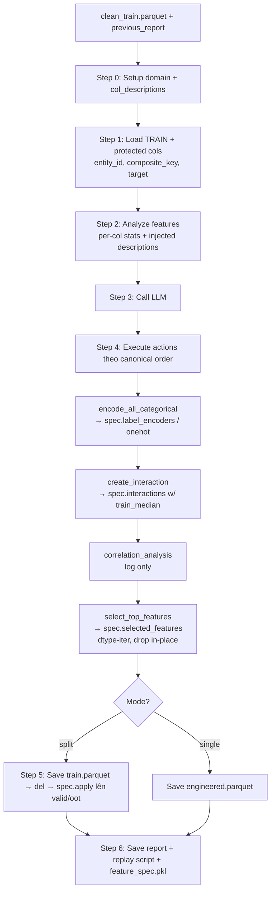

# Agent 2 — FeatureEngineer: Pipeline flow

> **Vai trò**: Sinh interaction features có ý nghĩa nghiệp vụ (theo `domain`), encode categorical, chọn top-K predictive features. Capture mọi transform vào `FeatureSpec` để replay deterministic lên valid/oot.

## Entry points

| Mode | Function | Input |
|---|---|---|
| Split mode | `process_splits()` ([line 593](../Agents/FeatureEngineer/agent_feature_engineer.py#L593)) | `train_path` từ Agent 1 + tùy chọn `valid_path`, `oot_path` |
| Single mode | `process()` ([line 661](../Agents/FeatureEngineer/agent_feature_engineer.py#L661)) | DataFrame đã clean + previous_report |

Cả 2 đều gọi `fit_transform()` ([line 558](../Agents/FeatureEngineer/agent_feature_engineer.py#L558)) cho TRAIN. Split mode sau đó `transform()` ([line 589](../Agents/FeatureEngineer/agent_feature_engineer.py#L589)) trên valid/oot từng partition.

---

## Step 0 — Setup ([line 130-159](../Agents/FeatureEngineer/agent_feature_engineer.py#L130-L159))

```
self.domain      ← credit_risk | propensity | fraud | generic
self.model_type  ← binary_classification | regression | multiclass
self._col_descriptions ← load JSON/CSV/Parquet/Excel mô tả cột (optional)
self.tool_registry      ← register 5 tools
```

`_DOMAIN_GUIDANCE` ([line 91-128](../Agents/FeatureEngineer/agent_feature_engineer.py#L91-L128)) inject domain-specific patterns vào system prompt:

| Domain | Pattern gợi ý |
|---|---|
| `credit_risk` | DTI, utilization, repayment quality, bureau delinquency, behavioral trend |
| `propensity` | RFM, engagement rate, product affinity, value (cumulative spend / tenure) |
| `fraud` | velocity (1h/24h), amount anomaly, network signals, time patterns |
| `generic` | ratio, frequency encoding, interaction giữa correlated predictors |

---

## Step 1 — Load TRAIN + setup protected cols ([line 569-575](../Agents/FeatureEngineer/agent_feature_engineer.py#L569-L575))

```
self.df = BaseAgent.load_dataframe(train_path)
self.target_column = _resolve_target_column(df, target_column)
self._setup_protected_cols(previous_report)
```

`_setup_protected_cols` ([line 518-543](../Agents/FeatureEngineer/agent_feature_engineer.py#L518-L543)) forward keys từ Agent 1's report:
- `_protected_cols` = composite_key ∪ entity_id (target tách riêng)
- `_date_col` = composite key partner không phải entity_id (vd `snap_dt`)

Mọi action `create_interaction`, `encode_categorical`, ... đều check protected set trước khi đụng vào.

---

## Step 2 — Analyze features ([line 577, 708-...](../Agents/FeatureEngineer/agent_feature_engineer.py#L577))

`_analyze_features()` build context cho LLM prompt:

- Sample numeric cols (cap theo `FEATURE_META_NUMERIC_RATIO=0.6` × `FEATURE_META_MAX_NUMERIC_COLS=200`)
- Cap categorical cols (`FEATURE_META_MAX_CATEGORICAL_COLS=40`)
- Per-col stats: dtype, null %, sample values, distribution
- Inject `_col_descriptions` (nếu có) cho cột — guide LLM tạo interaction có ý nghĩa nghiệp vụ

---

## Step 3 — Call LLM ([line 578-583](../Agents/FeatureEngineer/agent_feature_engineer.py#L578-L583))

```
prompt = build_engineering_prompt(analysis, previous_report)
response = call_llm(prompt, system_prompt, json_mode=True, max_tokens=LLM_MAX_TOKENS_LARGE)
```

System prompt (`prompts/system.txt`) enforce **canonical action ordering**:

```
encode_all_categorical → create_interaction(s) → correlation_analysis → select_top_features
```

> Skipping encode before select_top_features sẽ khiến cột non-numeric bị loại oan khỏi scoring.

LLM trả về JSON:
```json
{
    "reasoning": "...",
    "actions": [
        {"action": "encode_all_categorical", "method": "label", "reason": "..."},
        {"action": "create_interaction", "new_col": "dti_ratio", "expression": "df['debt'] / (df['income'] + 1)", "reason": "..."},
        {"action": "correlation_analysis", "reason": "..."},
        {"action": "select_top_features", "k": 100, "reason": "..."}
    ]
}
```

---

## Step 4 — Execute LLM decisions ([line 836-942](../Agents/FeatureEngineer/agent_feature_engineer.py#L836-L942))

### 5 action types

| Action | Vào spec? | Vai trò |
|---|---|---|
| `encode_all_categorical` | `spec.label_encoders` / `spec.onehot_columns` (batch) | Iterate non-numeric cols, label nếu `nunique > 5`, onehot nếu nhỏ |
| `encode_categorical` (single col) | same, single | Backup khi LLM target 1 cột cụ thể |
| `create_interaction` | `spec.interactions = (new_col, expression, train_median)` | Eval expression với sandbox `__builtins__={}`. Train median dùng để fill NaN/inf trên valid/oot |
| `correlation_analysis` | ❌ logged only | Output → log, không transform |
| `select_top_features` | `spec.selected_features` | `SelectKBest(f_classif)` trên numeric cols, giữ `k` best + non-numeric + target |

### create_interaction chi tiết ([line 344-365](../Agents/FeatureEngineer/agent_feature_engineer.py#L344-L365))

```python
df[new_col] = eval(expression, {"__builtins__": {}}, {"df": df, "np": np})
df[new_col] = df[new_col].replace([np.inf, -np.inf], np.nan)
fill_value = df[new_col].median()  ← train median, captured into spec
df[new_col] = df[new_col].fillna(fill_value)
spec.interactions.append((new_col, expression, fill_value))
```

→ Trên valid/oot replay sẽ dùng **train's median** (không phải valid/oot's median) → no leakage.

### encode_all_categorical chi tiết ([line 393-422](../Agents/FeatureEngineer/agent_feature_engineer.py#L393-L422))

Iterate `df.select_dtypes(exclude=number).columns` (trừ protected):
- `nunique > 5` → label encoding (fitted `LabelEncoder` + `"__NA__"` sentinel cho unseen)
- Otherwise → one-hot (`pd.get_dummies(drop_first=True)`, lưu list dummy cols)

Fitted encoder/dummy list được capture vào `spec` cho replay.

### select_top_features chi tiết ([line 465-528](../Agents/FeatureEngineer/agent_feature_engineer.py#L465-L528))

```
1. Phân loại cột: numeric vs non-numeric  (iterate dtypes metadata, KHÔNG slice df → tránh OOM 5 GB)
2. f_classif score từng numeric col vs target
3. Eligible: score > 0
4. k = min(LLM_requested, eligible_count)
5. selected_numeric = top-k by score
6. Final cols = selected_numeric + non_numeric_cols + target
7. df.drop(columns=unwanted, inplace=True)  ← in-place, tránh spike 2.6 GB từ df[final_cols]
```

Memory-aware: dùng `df.dtypes` thay vì `df[feature_cols].select_dtypes(...)` (đã fix OOM trong commit cc5990d).

Nếu LLM response không parse được → fallback `_fallback_engineering` chỉ label encode mọi non-numeric col.

---

## Step 5 — Save train + transform valid/oot (split mode) ([line 610-638](../Agents/FeatureEngineer/agent_feature_engineer.py#L610-L638))

```
1. train_df.to_parquet(ENGINEERED_TRAIN_PATH)  ← TMP_DIR
2. del train_df + self.df + gc.collect()
3. For tag in [valid, oot]:
       df = load_dataframe(in_path)
       df = transform(df, spec)              ← replay all transforms
       df.to_parquet(out_path)
       del df + gc.collect()
```

`spec.apply()` ([line 36-77](../Agents/FeatureEngineer/agent_feature_engineer.py#L36-L77)) replay đúng thứ tự fit-time:

1. **Interactions** — eval expression + replace inf + fillna với train_median
2. **Label encoders** — vectorized `Series.where(isin)` (10× nhanh hơn `apply(lambda)`), unseen → `"__NA__"`
3. **One-hot** — `reindex(columns=dummy_cols, fill_value=0)` → extra cols dropped, missing cols filled 0
4. **Selected features** — `df[keep]` (target preserved)

**Memory profile**: chỉ 1 partition trong RAM tại 1 thời điểm.

---

## Step 6 — Save artifacts

```
RUN_DIR/
├── feature_engineer_report.json    ← actions_taken, summary, feature_spec
├── pipeline_process_feature_engineer.py    ← script standalone replay
└── feature_spec.pkl                ← sidecar (fitted LabelEncoder objects không embed được inline)
```

Intermediate `engineered_*.parquet` ghi vào `TMP_DIR`, xoá khi pipeline kết thúc.

---

## Tổng quan flow



---

## Quy tắc no-leakage được enforce

| Rule | Cơ chế |
|---|---|
| Interactions fill từ train median | Capture vào `spec.interactions[2]` ([line 359](../Agents/FeatureEngineer/agent_feature_engineer.py#L359)) |
| LabelEncoder fit on train only | `__NA__` sentinel cho unseen valid/oot |
| One-hot dummy schema = train's | `reindex(columns=dummy_cols, fill_value=0)` extra cols dropped |
| Feature selection on train | `select_top_features` score chỉ train |
| Protected cols never engineered | `_protected_cols` check trước mọi action |
| Date col excluded from interactions | `_date_col` trong `_protected_cols` |
| Eval sandbox | `__builtins__={}`, chỉ expose `df` + `np` |

---

## Domain-specific feature patterns

Inject vào system prompt qua `_DOMAIN_GUIDANCE`. Ví dụ `credit_risk`:

```
- Debt burden        : credit_balance / (income + 1)
- Credit utilization : credit_drawn / (credit_limit + 1)
- Repayment quality  : overdue_amount / (total_due + 1)
- Bureau delinquency : bureau_dpd_count / (bureau_total_loans + 1)
- Behavioral trend   : compare recent MOB1-3 vs historical MOB1-12
Avoid leakage: do not use post-origination data or outcomes after observation cutoff.
```

LLM tham khảo pattern này khi gen `expression` cho `create_interaction`.

---

## Config knobs liên quan

| Param | Default | Vai trò |
|---|---|---|
| `HIGH_CORRELATION_THRESHOLD` | 0.8 | flag highly-correlated pairs |
| `LOW_CORRELATION_THRESHOLD` | 0.04 | report as low-signal |
| `TOP_K_FEATURES_CAP` | 350 | ceiling cho `select_top_features` |
| `TOP_K_RATIO` | 0.70 | suggested k = ratio × n_features |
| `FEATURE_META_NUMERIC_RATIO` | 0.6 | % numeric cols vào LLM prompt |
| `FEATURE_META_MAX_NUMERIC_COLS` | 200 | hard cap cho prompt |
| `FEATURE_META_MAX_CATEGORICAL_COLS` | 40 | cap cho categorical metadata |
| `MAX_DESC_PER_GROUP` | 30 | cap col_descriptions per group |

Full reference: [config_params.md](config_params.md).
