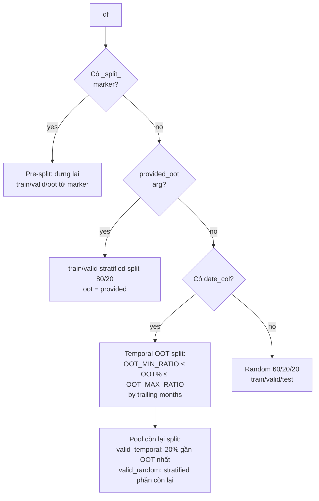

# Agent 3 — TrainModel: Pipeline 12 bước

> **Vai trò**: FLAML → Optuna → RFE → PSI → Stability → SHAP+PSI → Final train + eval + overfit-aware retrain. Output là model artifact + inference code + reports.

## Entry points

| Mode | Function | Input |
|---|---|---|
| Split mode | `process_splits()` ([line 1202](../Agents/TrainModel/agent_train_model.py#L1202)) | 3 file `engineered_train/valid/oot.parquet` → concat + add `_split_` marker → gọi `process()` |
| Single mode | `process()` ([line 1258](../Agents/TrainModel/agent_train_model.py#L1258)) | 1 df + previous report (FE) |

Cả 2 đều quy về `process()`. Đây là master orchestrator.

---

## Step 0 — Setup ([line 1258-1297](../Agents/TrainModel/agent_train_model.py#L1258-L1297))

```
df.copy() → self.df
target_column = _resolve_target_column(df, target_column)
date_col      = từ previous_report["composite_key_cols"] hoặc auto-detect
id_col        = từ previous_report["entity_id_col"] hoặc auto-detect
feature_cols  = df.columns trừ {target, date, id, _split_marker}
```

GPU auto-detect qua `nvidia-smi` → flag `gpu=YES/NO` log ra, thêm GPU params cho LightGBM/XGBoost/CatBoost nếu có.

---

## Step 1 — Data split ([line 287-477](../Agents/TrainModel/agent_train_model.py#L287-L477))

Logic chọn strategy theo input:



Temporal OOT logic chi tiết ([line 362-477](../Agents/TrainModel/agent_train_model.py#L362-L477)):
- Step 1: tăng `n_oot` (months) đến khi OOT% ≥ `OOT_MIN_RATIO` (15%)
- Step 2: floor min `OOT_INIT_MONTHS` (2)
- Step 3: ceiling — shrink nếu OOT% > `OOT_MAX_RATIO` (20%)
- valid_temporal = `VALID_TEMPORAL_RATIO` (20%) của valid set, lấy rows GẦN OOT boundary nhất by date

Output: dict 6 keys = `train, valid_temporal, valid_random, valid, oot, test` (một số có thể empty).

---

## Step 2 — Encode + dtype downcast ([line 83-147](../Agents/TrainModel/agent_train_model.py#L83-L147))

`X_train = _fit_prepare_X(train_df[feat_avail])` — fit encoder trên train:

| Cột gốc | Output | Bytes/row |
|---|---|---|
| Object/category | `LabelEncoder + astype(_smallest_int_dtype(len(classes_)))` → int8 nếu ≤127 cats, int16 nếu ≤32k, int32 lớn hơn | 1-4 B |
| Float64 | `fillna(-999).to_numpy(dtype=float32)` | 4 B |
| Int64 | `fillna(-999).to_numpy(dtype=int32)` | 4 B |
| Bool | `astype(int8)` | 1 B |
| NaN (cat) | `"__NA__"` sentinel | — |

`X_valid = _transform_X(...)` — dùng encoders đã fit (no leakage), vectorized `Series.where(isin)` cho unseen labels.

→ Benchmark: 100k × 1455 cols int64+float64 (1.08 GB) → int8/float32 (~150-450 MB). **9.6× reduction** trên 50k × 1400 mixed bench.

---

## Step 3 — FLAML AutoML ([line 482-540](../Agents/TrainModel/agent_train_model.py#L482-L540))

```python
AutoML.fit(
    estimator_list=[xgboost, lgbm, catboost, rf, extra_tree],  ← FLAML_ESTIMATORS
    metric="roc_auc",
    eval_method="holdout" if has_valid else "cv",
    X_val=X_valid_temporal,  ← no leakage to OOT
    y_val=y_valid_temporal,
    time_budget=flaml_budget,  ← dynamic theo n_rows × n_cols
    seed=RANDOM_STATE,
)
```

Nếu `len(X_train) > FLAML_MAX_ROWS` (500k), random sample xuống trước khi fit (FLAML internal `X.copy()` có thể OOM trên wide df).

`_compute_time_budget(n_rows, n_cols)` ([line 264-282](../Agents/TrainModel/agent_train_model.py#L264-L282)) — dynamic split FLAML vs Optuna budget theo data size.

**Output**: `best_estimator` (vd `"lgbm"`) + `best_config` (hyperparams base).

---

## Step 4 — Optuna fine-tuning ([line 596-645](../Agents/TrainModel/agent_train_model.py#L596-L645))

TPE sampler search hyperparams xung quanh FLAML's best:

```python
def objective(trial):
    params = _build_optuna_params(estimator_name, trial)  ← search space riêng cho từng model
    model = ModelClass(**params)
    model.fit(X_train, y_train)
    return roc_auc_score(y_valid, model.predict_proba(X_valid)[:, 1])

study = optuna.create_study(direction="maximize", sampler=TPESampler(seed=RANDOM_STATE))
study.optimize(objective, n_trials=OPTUNA_N_TRIALS, timeout=optuna_budget)
```

- Score trên **X_valid_temporal** (gần OOT nhất, tránh leak)
- `N_TRIALS=50 × timeout=600s` (whichever first)
- Replay `_build_optuna_params(FixedTrial(study.best_params))` để recover full param dict (vì `study.best_params` không có `random_state`/`n_jobs`/`verbose`)

Search space per estimator:

| Estimator | Hyperparam khác biệt |
|---|---|
| `lgbm` | `num_leaves` (15-256), `min_child_samples`, `subsample_freq` |
| `xgboost` | `min_child_weight`, `gamma`, `eval_metric=logloss` |
| `catboost` | `depth` (4-10), `l2_leaf_reg`, `bagging_temperature`, `random_strength` |
| `rf/extra_tree` | `min_samples_split`, `min_samples_leaf`, `max_features` |

---

## Step 5 — RFE ([line 649-679](../Agents/TrainModel/agent_train_model.py#L649-L679))

`RFE` hoặc `RFECV` (theo `Config.ENABLE_RFECV`):

```python
base_model = ModelClass(**best_params, n_estimators=RFE_N_ESTIMATORS)  ← 200, nhỏ hơn để nhanh

if ENABLE_RFECV:
    selector = RFECV(base_model, step=RFE_STEP, cv=StratifiedKFold(RFE_CV_SPLITS), scoring="roc_auc",
                     min_features_to_select=MAX_FINAL_FEATURES, n_jobs=-1)
else:
    selector = RFE(base_model, n_features_to_select=MAX_FINAL_FEATURES, step=RFE_STEP)

selector.fit(X_train, y_train)
```

- Eliminate `RFE_STEP=5%` mỗi vòng
- Target `MAX_FINAL_FEATURES=100`
- Fit trên TRAIN only (no leakage)

**Output**: list features rank by importance.

---

## Step 6 — PSI filter ([line 696-729](../Agents/TrainModel/agent_train_model.py#L696-L729))

Population Stability Index từng feature giữa train vs OOT:

```
PSI = Σ (actual% - expected%) × ln(actual% / expected%)  over PSI_BINS quantile buckets
```

- PSI > `PSI_THRESHOLD=0.3` → DROP (feature drift quá lớn)
- Skip nếu không có OOT hoặc feature object dtype
- Infinity guards: ±inf boundary cuts; eps floor on counts

**Output**: `psi_report.csv` + filtered feature list.

---

## Step 7 — Stability check ([line 743-785](../Agents/TrainModel/agent_train_model.py#L743-L785))

Monthly Gini theo `date_col`:
- Cần ≥ `STABILITY_MIN_MONTHS=6` tháng — không có thì skip
- Gini = `|2 × AUC - 1|` từng tháng (univariate, feature vs target)
- DROP nếu:
  - `std(gini) > STABILITY_GINI_STD_THRESHOLD=0.15` (không ổn định theo thời gian) HOẶC
  - `mean(gini) < STABILITY_MIN_GINI=0.02` (gần như không có predictive power)

**Output**: `stability_report.csv` + filtered features.

---

## Step 8 — SHAP+PSI iterative pruning ([line 789-938](../Agents/TrainModel/agent_train_model.py#L789-L938))

Greedy elimination cho đến khi valid AUC không cải thiện:

```python
while len(features) > MIN_FEATURES_FLOOR:
    shap_imp = SHAP value trên random sample SHAP_SAMPLE_SIZE=2000 của train (seeded)
    psi      = từ Step 6 lookup
    
    # Normalize 0-1
    shap_norm = (shap - shap.min) / (shap.max - shap.min)
    psi_norm  = (psi  - psi.min)  / (psi.max  - psi.min)
    
    # Combined score (cao = remove first)
    removal_score = 0.5 × (1 - shap_norm) + 0.5 × psi_norm
    worst = argmax(removal_score)
    
    candidate = features - {worst}
    candidate_auc = roc_auc_score(y_valid, refit(candidate).predict_proba(X_valid))
    
    if candidate_auc ≥ best_auc:
        accept; best_auc = candidate_auc; streak = 0
    else:
        streak += 1
    
    if streak ≥ SHAP_PSI_MAX_NO_IMPROVE=2: break
```

- SHAP qua `shap.TreeExplainer` (LGBM/XGB/CB native support). Fallback `model.feature_importances_` nếu SHAP fail
- Khi không có PSI data: `psi_weight = 0.0` → pure SHAP
- Min features floor: `max(SHAP_PSI_MIN_FEATURES_FLOOR=5, MAX_FINAL_FEATURES × SHAP_PSI_MIN_FEATURES_RATIO=10%)`

**Output**: `shap_psi_prune_log.csv` + final feature list.

---

## Step 9 — Refit-on-train+valid + evaluate ([`_tool_train_final_model`](../Agents/TrainModel/agent_train_model.py))

Sau khi feature selection + hyperparams đã **chốt** (tuning/selection chạy trên `train`, dùng `valid` làm ES/scoring holdout), model **đem deploy** được **huấn luyện lại trên toàn bộ dữ liệu in-time** để thấy hết mọi dòng trước khi gặp OOT/test. OOT (và `test` ở simple mode) **không bao giờ** bị gộp vào → giữ làm holdout nghiệm thu cuối.

```python
# 0. Merge: X_final = train + valid_temporal + valid_random  (hoặc `valid` ở simple mode)
#    OOT (và `test` ở simple mode) GIỮ LẠI làm holdout cuối.
X_final = concat(train, valid_temporal, valid_random)

# 1. K-fold CV trên X_final (một vòng, ra cả 2 thứ):
for tr, va in StratifiedKFold(CV_N_SPLITS).split(X_final):
    fold = ModelClass(**best_params).fit(X_final[tr], es_set=X_final[va])  # early stopping
    best_iters.append(fold.best_iteration)        # (a) tree count ổn định
    oof_raw[va] = fold.predict_proba(X_final[va]) # (b) out-of-fold preds (leakage-free)
best_iteration = median(best_iters)
cv_auc = mean(per-fold AUC trên oof)              # honest in-time estimate

# 2. Multi-seed refit trên TOÀN BỘ X_final, cố định n_estimators=best_iteration (KHÔNG ES)
ensemble = [ModelClass(**best_params, n_estimators=best_iteration, random_state=s).fit(X_final)
            for s in seeds]

# 3. Calibration KHÔNG leakage: isotonic/sigmoid fit trên oof_raw (CalibratedClassifierCV-style)
calibrator = fit_calibrator(oof_raw, y_final)

# 4. Per-split AUC + Brier
for split in [valid_temporal, valid_random, valid, oot, test]:
    metrics[f"{split}_auc"] = roc_auc_score(y_split, ensemble.predict_proba(X_split))
```

- `best_iteration` chỉ có với LGBM/XGB/CatBoost (có ES). RF/ExtraTrees/DART → `None`, refit với `n_estimators` từ `best_params`.
- `valid_*` giờ là **in-sample** (đã gộp vào train) → chỉ để minh bạch. **OOT/test** là holdout sạch; **`cv_auc_mean` (OOF)** là ước lượng generalization trung thực.
- Metrics mới: `final_trained_on="train+valid"`, `final_train_rows`, `best_iteration`, `calibration_split="cv_oof(train+valid)"`.

---

## Step 10 — Overfit check + LLM-guided retrain ([line 989-1097](../Agents/TrainModel/agent_train_model.py#L989-L1097))

```python
# ref = cv_auc_mean (OOF trên train+valid) — KHÔNG dùng valid_auc vì giờ là in-sample
gap = (cv_auc_mean - oot_auc) / cv_auc_mean
if gap > OVERFIT_THRESHOLD (12%):
    overrides = LLM(estimator, current_params, metrics, gap) → JSON với 4-6 reg overrides
    # Hoặc fallback _apply_conservative_regularization:
    #   - lgbm: ↑reg_alpha/lambda, ↓num_leaves/max_depth, ↑min_child_samples, ↓subsample
    #   - xgb : ↑reg_alpha/lambda, ↓max_depth, ↑min_child_weight, ↓subsample
    #   - cb  : ↑l2_leaf_reg, ↓depth, ↑random_strength, bagging_temperature=0.5
    #   - rf  : ↓max_depth, ↑min_samples_leaf/split, max_features='sqrt'
    retrain → quay lại Step 9
```

---

## Step 11 — SHAP visual + LLM-explained top features ([_tool_shap_final_explain](../Agents/TrainModel/agent_train_model.py))

Chỉ chạy khi `Config.SHAP_FINAL_EXPLAIN_ENABLED=true` (default). Compute SHAP trên **final model** (sau overfit retrain) — values phản ánh đúng cái thực sự ship.

```
1. _transform_X(splits["train"][final_features]) → X_tr
2. Sample SHAP_SAMPLE_SIZE=2000 rows (seeded RANDOM_STATE)
3. shap.TreeExplainer(self.model).shap_values(X_sample)
   • Binary: take positive-class slice
   • Fallback nếu shap fails: model.feature_importances_
4. importance = pd.Series(|SHAP|.mean(0)).sort_values(desc)
5. Bar plot top (2 × SHAP_FINAL_EXPLAIN_TOP_N) features → shap_summary.png
6. LLM call: prompt = top_N + col_descriptions + domain
   → JSON {explanations: [{feature, meaning, why_matters}]}
7. CSV: rank, feature, shap_importance, description, meaning, why_matters
   → shap_feature_explanations.csv
```

LLM prompt grounded với `col_descriptions` (forwarded từ FE) + `domain` (credit_risk / propensity / fraud / generic). Tự match ngôn ngữ description (Vietnamese description → reply Vietnamese).

Failure modes (graceful degrade):
- `shap` chưa cài → fallback `feature_importances_`
- `matplotlib` lỗi → skip PNG, vẫn save CSV
- LLM lỗi → CSV không có `meaning`/`why_matters` cols (chỉ rank + importance)

Knobs:

| Param | Default | Vai trò |
|---|---|---|
| `SHAP_FINAL_EXPLAIN_ENABLED` | `true` | Toggle toàn bộ step |
| `SHAP_FINAL_EXPLAIN_TOP_N` | `20` | Số features LLM explain (plot hiện 2× = 40) |
| `SHAP_SAMPLE_SIZE` | `2000` | Rows cho SHAP compute (shared với Step 8) |

---

## Step 12 — Save artifacts

```
RUN_DIR/
├── final_model.pkl              ← model + cat_encoders + feature_cols + target (joblib)
├── final_model_code.py          ← standalone inference: load .pkl + preprocess + predict_proba
├── pipeline_process_train_model.py    ← copy của final_model_code.py (consistent naming với Agent 1+2)
├── model_trainer_report.json    ← best_model, best_params, metrics, feature_count, shap_top_features
├── psi_report.csv
├── stability_report.csv
├── shap_psi_prune_log.csv
├── shap_summary.png             ← bar plot top 40 features bằng mean |SHAP|
├── shap_feature_explanations.csv ← rank, feature, shap_importance, description, meaning, why_matters
└── final_report.md              ← embed shap_summary.png + table top 20 + LLM narrative
```

`final_model_code.py` generated tự động — embed `FEATURES`, `CAT_COLS`, `BEST_PARAMS` as Python literals, load model.pkl tại runtime. Self-contained inference script.

`final_report.md` đoạn cuối có section "SHAP — Top features driving the final model" với:
- Embedded image ``
- Markdown table: Rank | Feature | SHAP importance | Meaning | Why it matters
- Link tới CSV đầy đủ

---

## Tổng quan flow

```mermaid
flowchart LR
    A[df + previous_report] --> B[Step 0: Setup]
    B --> C[Step 1: Split<br/>train/valid_temporal/valid_random/valid/oot/test]
    C --> D[Step 2: Encode + dtype downcast<br/>fit on train, transform valid/oot]
    D --> E[Step 3: FLAML<br/>chọn estimator + base hyperparams]
    E --> F[Step 4: Optuna<br/>fine-tune trên valid_temporal]
    F --> G[Step 5: RFE<br/>cắt → MAX_FINAL_FEATURES]
    G --> H[Step 6: PSI filter<br/>train vs OOT]
    H --> I[Step 7: Stability<br/>monthly Gini]
    I --> J[Step 8: SHAP+PSI prune<br/>greedy elimination]
    J --> K[Step 9: Final train + eval<br/>CV + holdouts]
    K --> L{Step 10: Overfit?}
    L -->|yes, < MAX_ITERS| F
    L -->|no, or maxed| N[Step 11: SHAP visual + LLM explain<br/>shap_summary.png + top N narrative]
    N --> M[Step 12: Save artifacts<br/>+ embed SHAP section vào final_report.md]
```



---

## Quy tắc no-leakage được enforce

| Step | Sử dụng data nào | Tránh leak gì |
|---|---|---|
| Encode fit | TRAIN | Không peek valid/oot |
| FLAML | TRAIN | eval_method=holdout dùng valid_temporal, không peek OOT |
| Optuna | TRAIN | objective score trên valid_temporal |
| RFE | TRAIN | CV trên train |
| PSI filter | TRAIN vs OOT (distribution only) | Không dùng y_OOT |
| Stability | TRAIN | monthly Gini chỉ train |
| SHAP prune | TRAIN + valid | Không peek OOT |
| Final train | TRAIN | OOT/test chỉ để report |
| Overfit check | valid vs OOT (gap) | OOT vào để **đo**, không vào loss |

---

## Reproducibility

Mọi random ops đều seed bằng `Config.RANDOM_STATE=42`:
- FLAML: `seed=RANDOM_STATE`
- Optuna TPESampler: `seed=RANDOM_STATE`
- StratifiedKFold (CV + RFE): `random_state=RANDOM_STATE`
- SHAP sample: `np.random.default_rng(RANDOM_STATE)`
- Sklearn estimators: param `random_state` từ Optuna search space
- FLAML sample (when > FLAML_MAX_ROWS): `np.random.RandomState(RANDOM_STATE)`

Override qua `.env`: `RANDOM_STATE=...`.

---

## Config knobs liên quan

| Param | Default | Vai trò |
|---|---|---|
| `FLAML_TIME_BUDGET` | 1200s | Cap thời gian FLAML |
| `FLAML_ESTIMATORS` | `xgboost,lgbm,catboost,rf,extra_tree` | Danh sách model thử |
| `FLAML_MAX_ROWS` | 500_000 | Sample trước khi feed FLAML |
| `OPTUNA_N_TRIALS` | 50 | Số trial Optuna |
| `OPTUNA_TIMEOUT` | 600s | Cap thời gian Optuna |
| `RFE_TARGET_FEATURES` | 50 | Target sau RFE |
| `RFE_N_ESTIMATORS` | 200 | n_estimators cho base model RFE |
| `RFE_STEP` | 0.05 | Eliminate 5%/round |
| `MAX_FINAL_FEATURES` | 100 | Final cap features |
| `PSI_THRESHOLD` | 0.3 | DROP nếu PSI vượt |
| `PSI_BINS` | 100 | Quantile buckets |
| `STABILITY_MIN_MONTHS` | 6 | Min tháng để chạy stability |
| `STABILITY_GINI_STD_THRESHOLD` | 0.15 | DROP nếu std gini lớn |
| `STABILITY_MIN_GINI` | 0.02 | DROP nếu mean gini thấp |
| `SHAP_N_ESTIMATORS` | 100 | n_estimators cho refit mỗi prune step |
| `SHAP_SAMPLE_SIZE` | 2000 | Rows cho SHAP value |
| `SHAP_PSI_MAX_NO_IMPROVE` | 2 | Stop sau N step không cải thiện |
| `SHAP_PSI_MIN_FEATURES_FLOOR` | 5 | Sàn cứng features |
| `SHAP_PSI_MIN_FEATURES_RATIO` | 0.10 | Sàn tương đối (×MAX_FINAL_FEATURES) |
| `OVERFIT_THRESHOLD` | 0.12 | Gap (valid-oot)/valid vượt → retrain |
| `CV_N_SPLITS` | 5 | Final CV folds |
| `RANDOM_STATE` | 42 | Seed mọi random op |
| `OOT_INIT_MONTHS` | 2 | Floor cho OOT |
| `OOT_MIN_RATIO` | 0.15 | Min OOT% |
| `OOT_MAX_RATIO` | 0.20 | Max OOT% |
| `VALID_TEMPORAL_RATIO` | 0.20 | % valid gần OOT |

Full reference: [config_params.md](config_params.md).
