# Architecture & Visual Walkthrough

Tài liệu mô tả trực quan từng phần của pipeline. Mọi sơ đồ dùng [Mermaid](https://mermaid.js.org/) và render trực tiếp trên GitHub.

---

## 1. Project Structure Overview

```
multi-agent-auto-ml-v1.1/
│
├── main.py                  ◄── CLI entry point
├── pipeline.py              ◄── AutoMLPipeline orchestrator
├── handoff.py               ◄── State holder giữa các agent
├── logger.py                ◄── AgentLogger (log + markdown report)
├── config.py                ◄── Config + LLM client factory
├── config.yaml              ◄── LiteLLM proxy config
│
├── Agents/
│   ├── BaseAgent/
│   │   └── base_agent.py                ◄── LLM call + load_dataframe + ToolRegistry
│   ├── DataCleaner/
│   │   ├── agent_data_cleaner.py        ◄── Agent 1
│   │   └── prompts/{system,user}.txt
│   ├── FeatureEngineer/
│   │   ├── agent_feature_engineer.py    ◄── Agent 2
│   │   └── prompts/{system,user}.txt
│   └── TrainModel/
│       ├── agent_train_model.py         ◄── Agent 3
│       └── prompts/{llm_summary_*}.txt
│
├── data/
│   ├── process_home_data.py             ◄── Script chuẩn bị HomeCredit
│   └── HomeCredit_columns_description.csv
│
├── docs/
│   ├── config_params.md                 ◄── Reference ~70 config params
│   └── architecture.md                  ◄── (file này)
│
├── outputs/                             ◄── Auto-tạo, chứa toàn bộ output
└── tests/
    ├── test_agent1.py
    ├── test_agent2.py
    └── test_agent3.py
```

### Mối quan hệ giữa các module

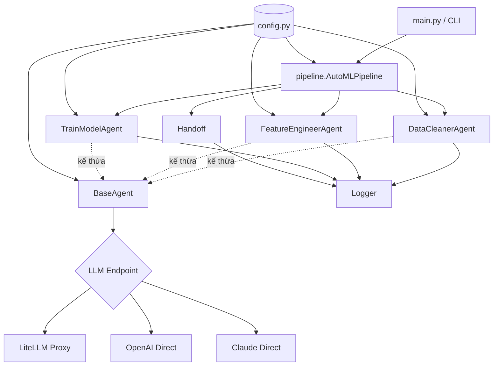

---

## 2. High-Level Pipeline Flow

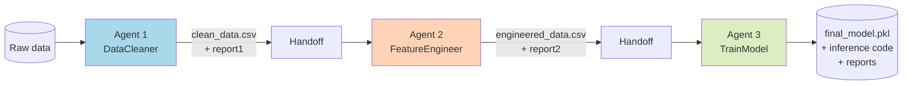

Mỗi agent đều theo cùng pattern:

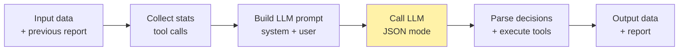

---

## 3. Agent 1 — DataCleaner

**Vai trò**: Audit chất lượng dữ liệu, sửa schema, loại bỏ duplicate / cột rác, KHÔNG làm feature selection.

### Sơ đồ hoạt động

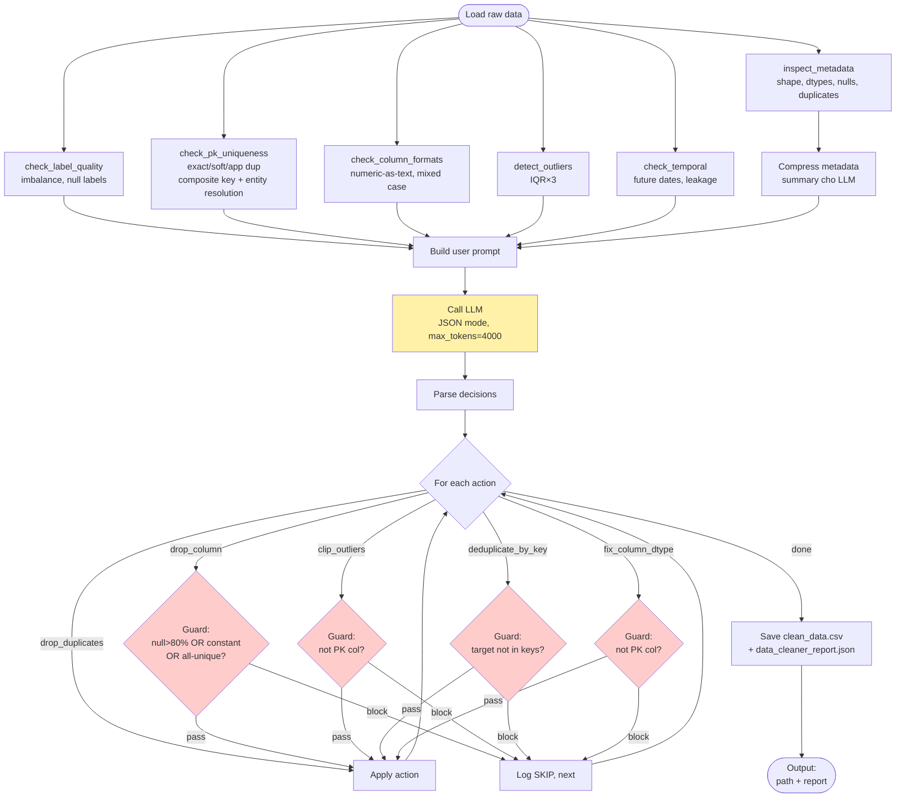

### Tools registry

| Tool | Mục đích |
|---|---|
| `inspect_metadata` | Shape, dtypes, null counts, duplicate stats |
| `get_column_stats` | Distribution / unique values 1 cột |
| `drop_column` | Xoá cột |
| `detect_outliers` | IQR×3 outlier detection |
| `check_label_quality` | Class balance, null labels |
| `check_temporal` | Date range, future dates, leakage |
| `drop_duplicates` | Xoá row trùng exact |
| `clip_outliers` | Clip về bounds IQR×3 |
| `check_pk_uniqueness` | PK / composite key / entity resolution |
| `deduplicate_by_key` | Dedup theo composite key |
| `check_column_formats` | numeric-as-text, mixed case, whitespace |
| `fix_column_dtype` | Cast numeric/datetime/strip/standardize |

### Protected columns

DataCleanerAgent giữ một set "không bao giờ được động vào":

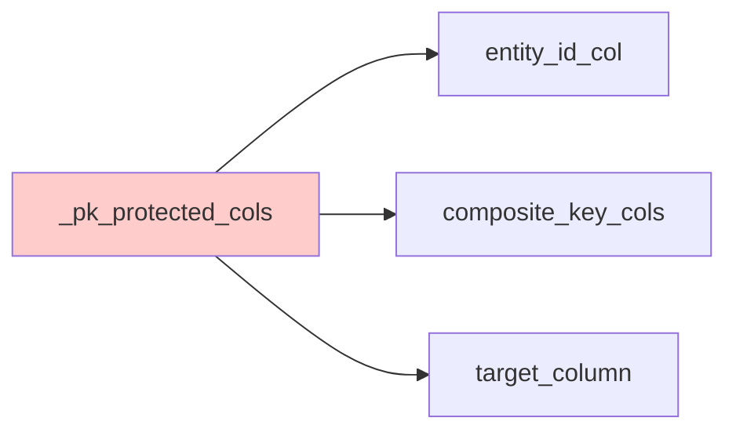

Mọi action `drop_column`, `clip_outliers`, `fix_column_dtype` đều check set này trước.

### Output

- `outputs/clean_data.csv`
- `outputs/data_cleaner_report.json` — chứa `entity_id_col`, `composite_key_cols`, `target_column`, `actions_taken`, `summary`

---

## 4. Agent 2 — FeatureEngineer

**Vai trò**: Tạo interaction feature có ý nghĩa nghiệp vụ, encode categorical, chọn top-K predictive features.

### Sơ đồ hoạt động

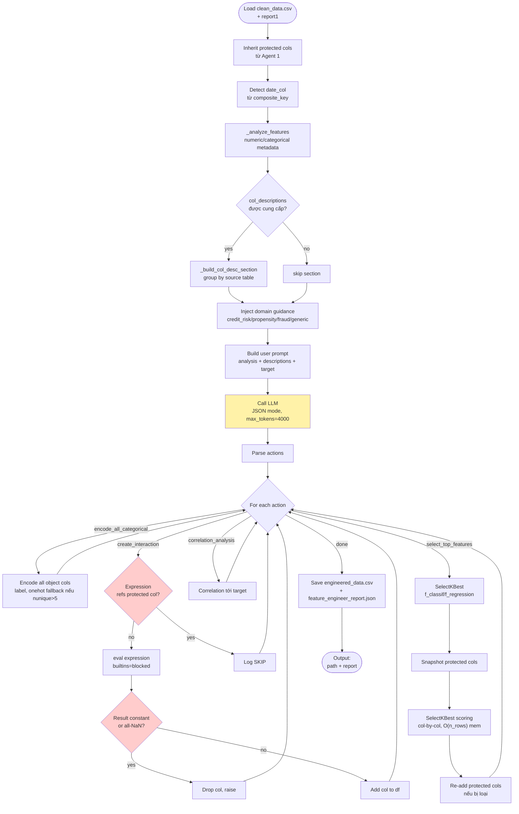

### Domain guidance — inject vào system prompt

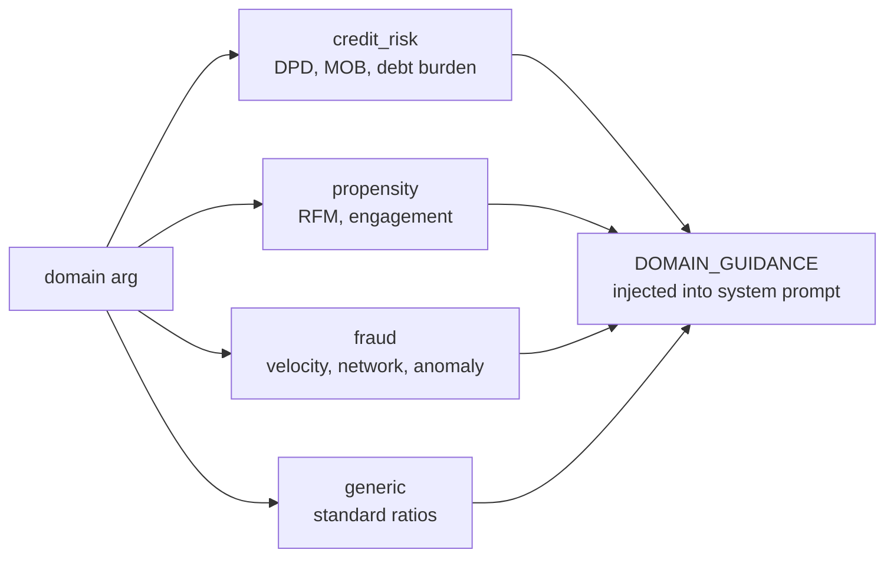

### Tools

| Tool | Mục đích |
|---|---|
| `create_interaction` | Tạo cột mới qua expression (`df['a'] / df['b']`) |
| `encode_categorical` | Encode 1 cột (label/onehot) |
| `encode_all_categorical` | Encode toàn bộ object cols cùng lúc (preferred) |
| `correlation_analysis` | Pearson corr tới target |
| `select_top_features` | Giữ top-K theo `f_classif` / `f_regression` |

### Action order (rule)

```
encode_all_categorical → create_interaction(s) → correlation_analysis → select_top_features
```

Nếu LLM bỏ qua thứ tự (vd. select trước encode), các cột object sẽ bị loại oan vì SelectKBest không score được.

### Output

- `outputs/engineered_data.csv`
- `outputs/feature_engineer_report.json` — forward `entity_id_col`, `composite_key_cols`, `target_column` cho Agent 3

---

## 5. Agent 3 — TrainModel

**Vai trò**: AutoML pipeline đầy đủ — chọn estimator, fine-tune, lọc feature theo 5 tầng, train final + đánh giá đa split, detect overfit.

### Sơ đồ hoạt động tổng quan

```mermaid
flowchart TD
    Start([Load engineered_data<br/>+ report2]) --> Detect[Detect target / date_col / id_col<br/>ưu tiên report, fallback auto-detect]
    Detect --> Split[Step 1: Split data]

    Split --> S1{date_col<br/>tồn tại?}
    S1 -->|yes| OOT[OOT temporal split<br/>train + valid_temporal + valid_random + oot]
    S1 -->|no| Simple[60/20/20 stratified split<br/>train + valid + test]

    OOT --> Encode[Fit LabelEncoder trên train<br/>__NA__ sentinel cho NaN]
    Simple --> Encode

    Encode --> Budget[Compute time budget<br/>scale theo n_rows × n_cols]
    Budget --> Flaml[Step 2: FLAML AutoML<br/>chọn best estimator]
    Flaml --> Optuna[Step 3: Optuna fine-tune<br/>TPE sampler trên valid_temporal]

    Optuna --> RFE[Step 4: RFE<br/>cắt xuống MAX_FINAL_FEATURES]
    RFE --> PSI[Step 5: PSI filter<br/>drop drift>threshold giữa train và OOT]
    PSI --> Stab[Step 6: Stability check<br/>drop std Gini theo tháng cao]
    Stab --> SHAP[Step 7: SHAP+PSI iterative prune<br/>cho đến khi AUC ngừng tăng]

    SHAP --> Final[Step 8: Train final model<br/>+ eval trên CV, valid, OOT, test]

    Final --> Over{Overfit detected?<br/>gap > OVERFIT_THRESHOLD}
    Over -->|no| Save
    Over -->|yes| LLMReg[LLM-guided retrain<br/>regularization mạnh hơn]
    LLMReg --> Cmp{"Retry holdout<br/>>= original?"}
    Cmp -->|yes| Save
    Cmp -->|no| Revert[Restore original model]
    Revert --> Save

    Save[Save final_model.pkl<br/>+ final_model_code.py<br/>+ reports + CSVs]
    Save --> Summary[Gen LLM summary]
    Summary --> End([Output:<br/>metrics + report])

    style Flaml fill:#a8d8ea
    style Optuna fill:#a8d8ea
    style RFE fill:#dcedc1
    style PSI fill:#dcedc1
    style Stab fill:#dcedc1
    style SHAP fill:#dcedc1
    style LLMReg fill:#fff2a8
    style Over fill:#ffcccc
```

### Step 1 — Data Split chi tiết

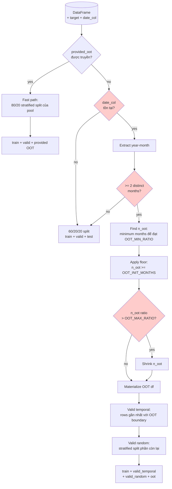

### Steps 2-3 — FLAML → Optuna

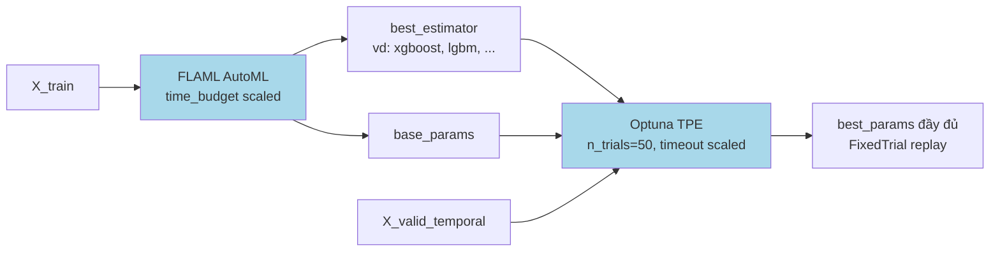

### Steps 4-7 — Feature Selection 5 tầng

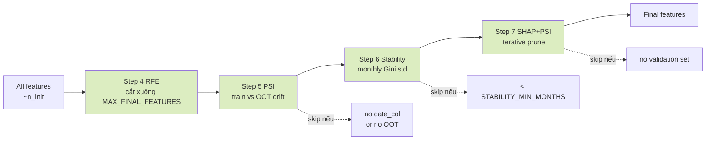

### Step 7 — SHAP+PSI Iterative Prune chi tiết

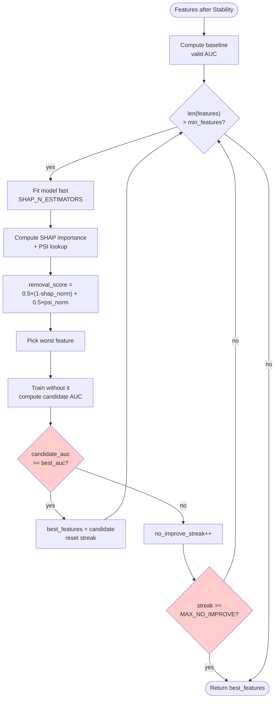

### Step 8 — Overfitting Detection & Retrain


### Tools nội bộ

| Tool | Mục đích |
|---|---|
| `_tool_split_data` | OOT temporal split (auto / provided OOT / fallback simple) |
| `_tool_run_flaml` | FLAML AutoML chọn estimator |
| `_tool_run_optuna` | Fine-tune hyperparams |
| `_tool_run_rfe` | RFE / RFECV feature selection |
| `_tool_run_psi_filter` | Drop feature theo PSI drift |
| `_tool_run_stability_check` | Drop feature theo monthly Gini std |
| `_tool_shap_psi_prune` | Iterative SHAP+PSI prune |
| `_tool_train_final_model` | Train final + eval đa split |

### Output

| File | Mô tả |
|---|---|
| `outputs/final_model.pkl` | model + cat_encoders + feature_cols + target |
| `outputs/final_model_code.py` | Standalone inference code |
| `outputs/model_trainer_report.json` | JSON report đầy đủ |
| `outputs/psi_report.csv` | PSI score từng feature |
| `outputs/stability_report.csv` | Mean + std Gini theo tháng |
| `outputs/shap_psi_prune_log.csv` | Log từng step pruning |

---

## 6. Handoff & State Flow

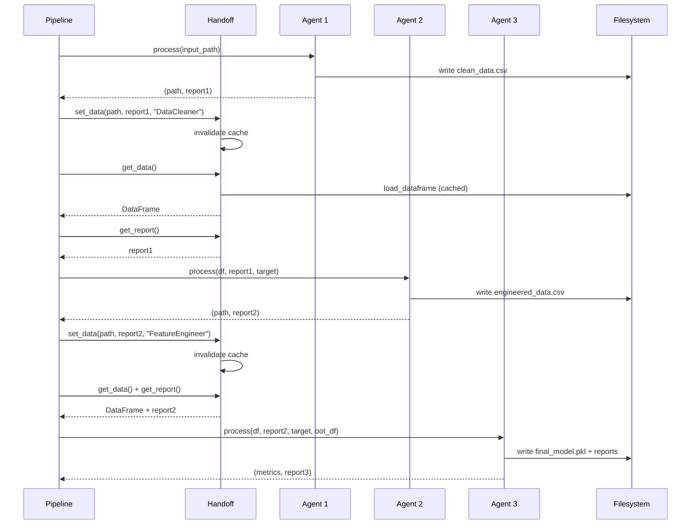

---

## 7. LLM Fallback Strategy

Project hỗ trợ **2 backend** chọn qua env var `LLM_BACKEND`. Mỗi backend có chiến lược khác nhau:

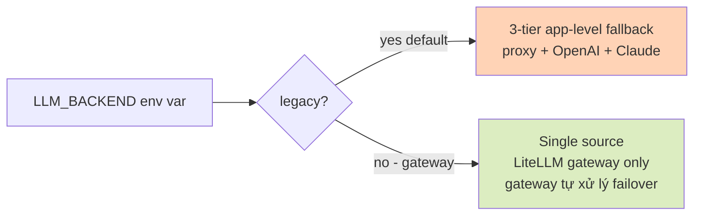

### Gateway backend (`LLM_BACKEND=gateway`)

Mỗi `call_llm()` đi thẳng tới gateway, KHÔNG có app-level fallback (gateway tự xử lý nội bộ):

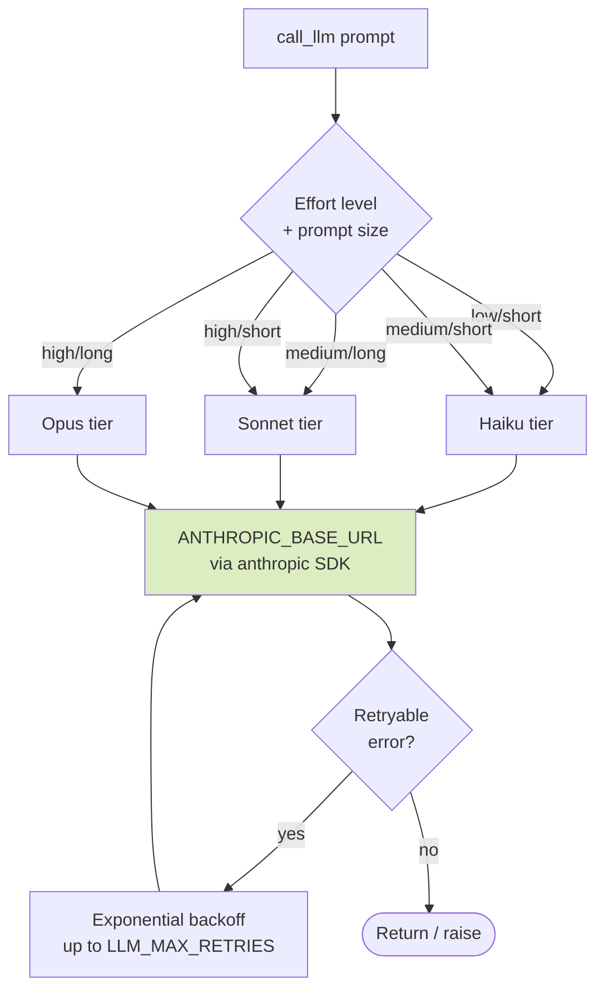

### Legacy backend (`LLM_BACKEND=legacy`, default)

Mỗi `call_llm()` đi qua chain 4 bước:

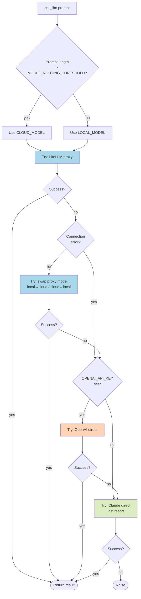

Mỗi attempt còn có **retry exponential backoff** cho lỗi rate-limit (429) và server (5xx), với `LLM_MAX_RETRIES=3`, base delay `LLM_RETRY_DELAY=2s`.

---

## 8. Protected Columns — bảo vệ key columns xuyên suốt

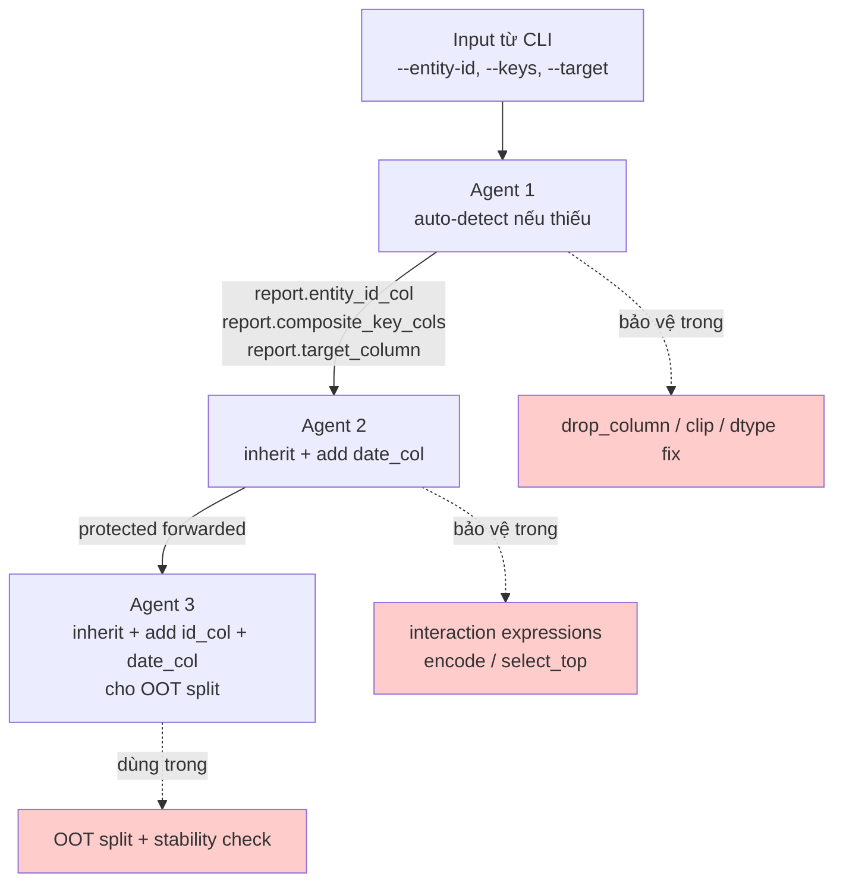

---

## 9. Output Folder Map

Sau khi pipeline chạy xong, `outputs/` chứa:

```
outputs/
├── clean_data.csv                    ◄── Agent 1 output
├── engineered_data.csv               ◄── Agent 2 output
│
├── data_cleaner_report.json          ◄── Agent 1 actions + decisions
├── feature_engineer_report.json      ◄── Agent 2 actions + decisions
├── model_trainer_report.json         ◄── Agent 3 metrics + feature pipeline
│
├── psi_report.csv                    ◄── PSI drift per feature
├── stability_report.csv              ◄── Monthly Gini stats
├── shap_psi_prune_log.csv            ◄── Pruning step-by-step log
│
├── final_model.pkl                   ◄── Model + encoders (joblib)
├── final_model_code.py               ◄── Standalone inference script
│
├── final_report.md                   ◄── Full markdown report
└── agent_execution.log               ◄── Plain-text execution log
```

---

## 10. Tham chiếu nhanh

- [README.md](../README.md) — Quick start + CLI examples
- [docs/config_params.md](config_params.md) — Reference toàn bộ ~70 config params
- [pipeline.py](../pipeline.py) — Orchestrator chính
- [Agents/BaseAgent/base_agent.py](../Agents/BaseAgent/base_agent.py) — LLM call + tool execution + helpers
