# Architecture & Visual Walkthrough

Tài liệu mô tả trực quan từng phần của pipeline. Mọi sơ đồ dùng [Mermaid](https://mermaid.js.org/) và render trực tiếp trên GitHub.

> **Architecture v1.1**

---

## 1. Project Structure Overview

```
multi-agent-auto-ml-v1.1/
│
├── main.py                  ◄── CLI entry point
├── pipeline.py              ◄── AutoMLPipeline orchestrator + Stage 0a/0b
├── splitting.py             ◄── Chia train/valid/oot (dùng chung pipeline + Agent 3)
├── logger.py                ◄── AgentLogger (log + markdown report)
├── config.py                ◄── Config + LLM client factory
├── config_gateway.py        ◄── GatewayConfig override khi LLM_BACKEND=gateway
├── config.yaml              ◄── LiteLLM proxy config
├── _e2e_check.py            ◄── 6-test end-to-end smoke suite
│
├── Agents/
│   ├── BaseAgent/
│   │   └── base_agent.py                ◄── LLM call + load_dataframe + smart Excel reader
│   ├── DataCleaner/
│   │   ├── agent_data_cleaner.py        ◄── Agent 1 + CleaningSpec dataclass
│   │   └── prompts/{system,user}.txt
│   ├── FeatureEngineer/
│   │   ├── agent_feature_engineer.py    ◄── Agent 2 + FeatureSpec dataclass
│   │   └── prompts/{system,user}.txt
│   └── TrainModel/
│       ├── agent_train_model.py         ◄── Agent 3
│       └── prompts/{llm_summary_*}.txt
│
├── data/
│   ├── process_home_data.py             ◄── Script chuẩn bị HomeCredit
│   └── HomeCredit_columns_description.csv
│
├── docs/
│   ├── architecture.md                  ◄── (file này)
│   ├── awareness-pattern.md             ◄── Agentic pattern reference
│   └── config_params.md                 ◄── Reference ~75 config params
│
├── outputs/                             ◄── Auto-tạo
│   └── YYYY-MM-DD/                          ◄── 1 thư mục / ngày
│       └── run_NN/                              ◄── 1 thư mục / lần chạy (counter reset mỗi ngày)
│           ├── agent_execution.log
│           ├── data_cleaner_report.json, feature_engineer_report.json, model_trainer_report.json
│           ├── psi_report.csv, stability_report.csv, shap_psi_prune_log.csv
│           ├── final_report.md
│           ├── final_model.pkl, final_model_code.py
│           ├── pipeline_process_data_cleaner.py        ◄── replay Agent 1 (embed CleaningSpec)
│           ├── pipeline_process_feature_engineer.py    ◄── replay Agent 2
│           ├── feature_spec.pkl                            ◄── sidecar (fitted LabelEncoders)
│           └── pipeline_process_train_model.py         ◄── replay Agent 3 (= inference code)
└── tests/
    ├── test_agent1.py
    ├── test_agent2.py
    └── test_agent3.py
```

Intermediate `clean_*.parquet` / `engineered_*.parquet` (handoff giữa agents) **không lưu vào `run_NN/`** — ghi vào system tempdir và xoá sau khi pipeline kết thúc (try/finally). Set `KEEP_INTERMEDIATES=true` trong `.env` nếu muốn giữ để debug.

### Mối quan hệ giữa các module

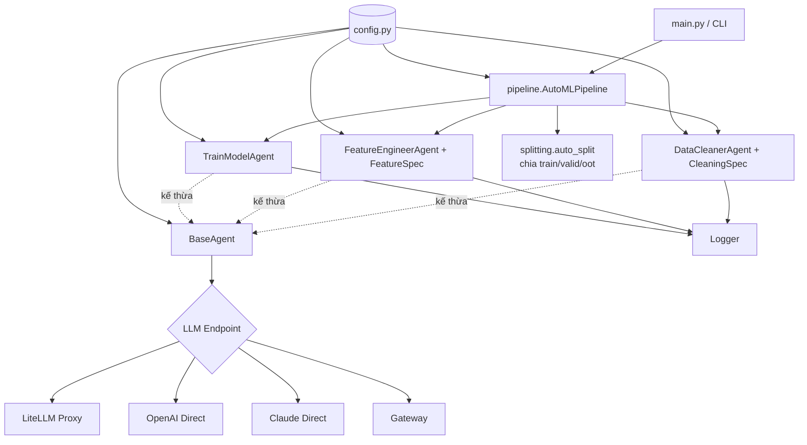

---

## 2. High-Level Pipeline Flow — 2 modes

Pipeline tự chọn mode dựa trên CLI args:

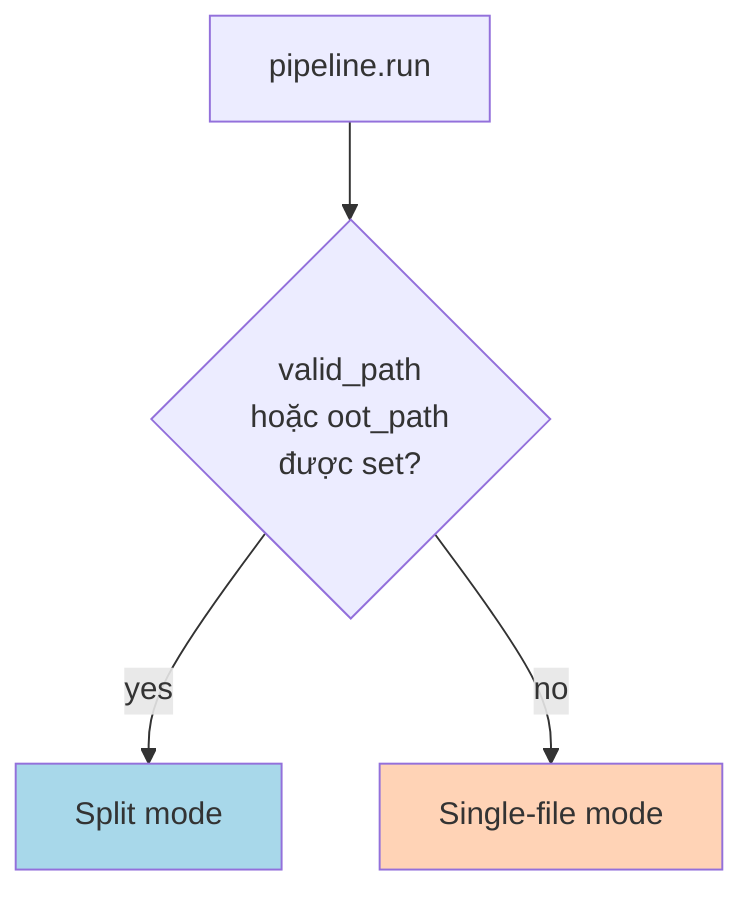

### Split mode — fit-on-train + transform-on-valid/oot

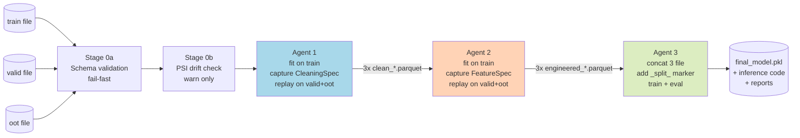

### Single-file mode — Agent 3 tự auto-split

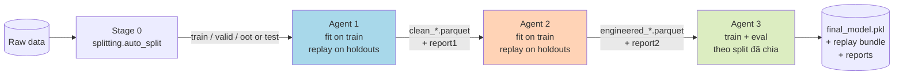

### Pattern mỗi agent (split mode)

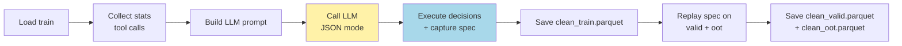

---

## 3. Stage 0a — Schema Validation (split mode only)

Trước cả Agent 1, schema được scan từ metadata (không load full data):

- **Parquet**: `pyarrow.parquet.read_schema` — 1 disk seek
- **CSV**: `pd.read_csv(nrows=1000)` để infer dtype
- **Khác**: fallback `BaseAgent.load_dataframe` (Excel/Feather/ORC nhỏ)

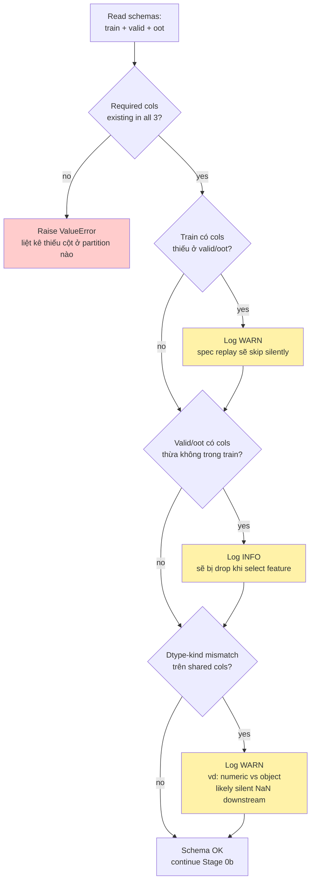

**Hard errors** (raise → abort pipeline):
- `target_column` thiếu ở bất kỳ partition nào
- `entity_id_col` thiếu
- Bất kỳ `composite_key_cols` nào thiếu

**Warnings** (log → tiếp tục):
- Train có cột missing ở valid/oot
- Valid/oot có cột thừa
- Dtype-kind mismatch (numeric vs object)

---

## 4. Stage 0b — Distribution Drift Check (split mode only, optional)

PSI-based drift check, sample 50K rows mỗi partition:

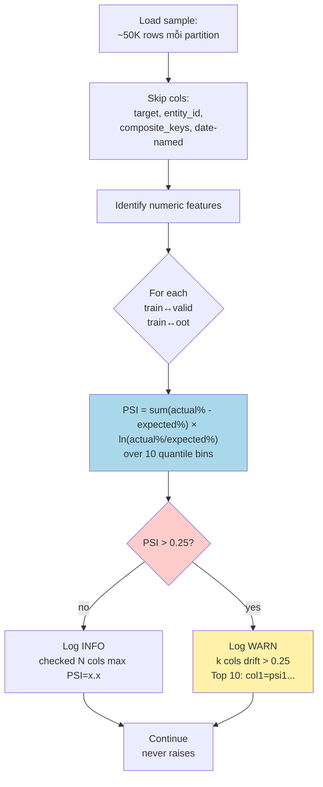

**Disable**: `--no-drift-check` hoặc `check_distribution=False` trong `pipeline.run`.

---

## 5. Agent 1 — DataCleaner

**Vai trò**: Audit chất lượng dữ liệu, sửa schema, loại bỏ duplicate / cột rác. Capture mọi transform vào `CleaningSpec` để replay lên valid/oot.

### Sơ đồ hoạt động (split mode)

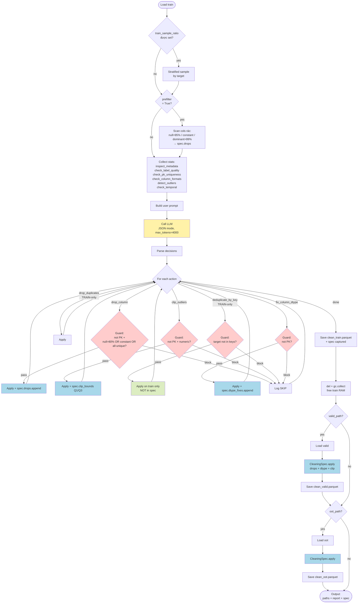

### CleaningSpec dataclass

```python
@dataclass
class CleaningSpec:
    drops:       List[str]                       # prefilter + drop_column actions
    dtype_fixes: List[Tuple[str, str]]           # (col, fix_type)
    clip_bounds: Dict[str, Tuple[float, float]]  # col → (lower, upper) từ Q1/Q3 train
    # KHÔNG include drop_duplicates / dedup_by_key → row ops, train-only
```

**Replay** (`spec.apply(df)`):
1. Drop cols trong `spec.drops` nếu còn trong df
2. Áp `dtype_fixes`: `cast_to_numeric` / `cast_to_datetime` / `strip_whitespace` / `standardize_case`
3. Áp `clip_bounds`: `df[col].clip(lower, upper)` với bounds từ train

### Tools registry

| Tool | Mục đích |
|---|---|
| `inspect_metadata` | Shape, dtypes, null counts, duplicate stats |
| `get_column_stats` | Distribution / unique values 1 cột |
| `drop_column` | Xoá cột → capture vào `spec.drops` |
| `detect_outliers` | IQR×3 outlier detection |
| `check_label_quality` | Class balance, null labels |
| `check_temporal` | Date range, future dates, leakage |
| `drop_duplicates` | Xoá row trùng exact (TRAIN-only) |
| `clip_outliers` | Clip về Q1±factor×IQR → capture vào `spec.clip_bounds` |
| `check_pk_uniqueness` | PK / composite key / entity resolution |
| `deduplicate_by_key` | Dedup theo composite key (TRAIN-only) |
| `check_column_formats` | numeric-as-text, mixed case, whitespace |
| `fix_column_dtype` | Cast numeric/datetime/strip/standardize → capture vào `spec.dtype_fixes` |

### Protected columns

DataCleanerAgent giữ một set "không bao giờ được động vào":

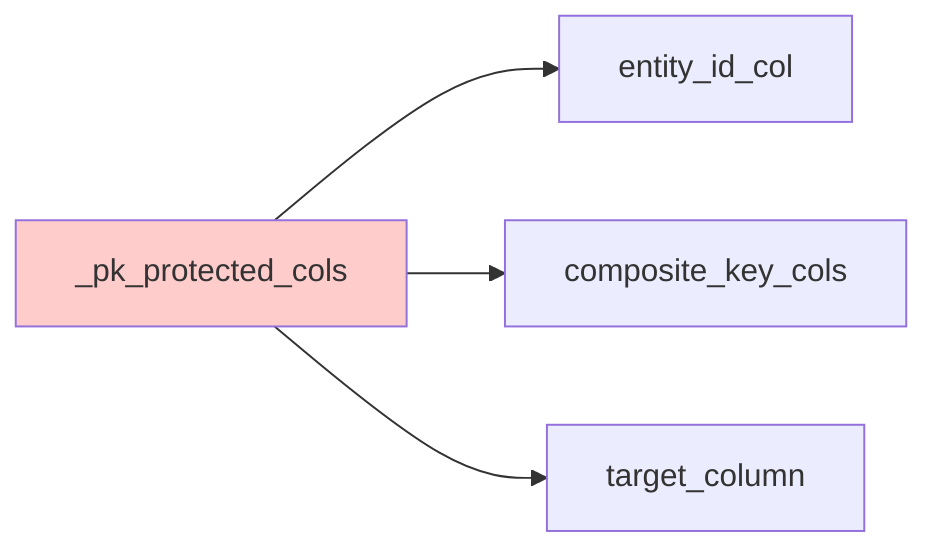

Mọi action `drop_column`, `clip_outliers`, `fix_column_dtype` đều check set này trước.

### Mixed-type object cols — `_safe_str_map`

Cột `object` dtype không có nghĩa toàn string — có thể chứa NaN, int, dict trộn lẫn. Helper `_safe_str_map(series, fn)` chỉ apply `fn` lên cells thực sự là string, giữ nguyên NaN/None/numbers:

```python
def _safe_str_map(series, fn):
    return series.map(lambda x: fn(x) if isinstance(x, str) else x)
```

Tránh được crash `AttributeError: Can only use .str accessor with string values!` trên mixed-type cols ở `check_column_formats` + `fix_column_dtype`.

### Output

Intermediate handoff files (`clean_*.parquet`) ghi vào **system tempdir** (`TMP_DIR`) và xoá sau khi pipeline kết thúc — không vào `run_NN/` (set `KEEP_INTERMEDIATES=true` để giữ).

**Persisted vào `RUN_DIR` = `outputs/YYYY-MM-DD/run_NN/`** (cả 2 mode):
- `data_cleaner_report.json` — chứa `entity_id_col`, `composite_key_cols`, `target_column`, `actions_taken`, `summary`, `cleaning_spec` (serialized)
- `pipeline_process_data_cleaner.py` — script Python standalone replay `CleaningSpec` (drops + dtype_fixes + clip_bounds embed inline) trên data mới

---

## 6. Agent 2 — FeatureEngineer

**Vai trò**: Tạo interaction feature có ý nghĩa nghiệp vụ, encode categorical, chọn top-K predictive features. Capture mọi transform vào `FeatureSpec` để replay lên valid/oot.

### Sơ đồ hoạt động (split mode)

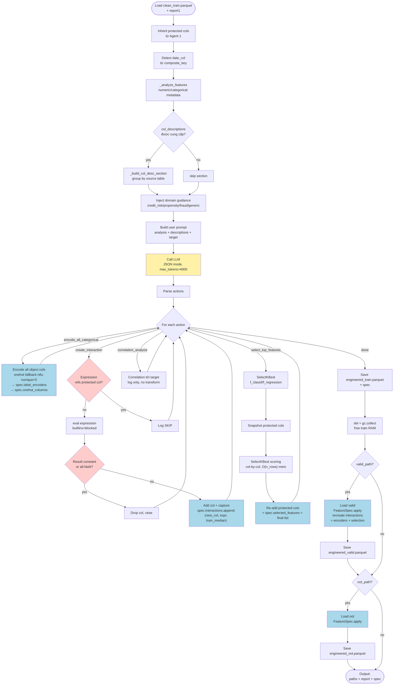

### FeatureSpec dataclass

```python
@dataclass
class FeatureSpec:
    interactions:      List[Tuple[str, str, float]] # (new_col, expression, train_median_fill)
    label_encoders:    Dict[str, LabelEncoder]      # fitted on train, with __NA__ sentinel
    onehot_columns:    Dict[str, List[str]]         # col → train dummy column names
    selected_features: Optional[List[str]]          # if select_top_features was called
    target_column:     Optional[str]
```

**Replay** (`spec.apply(df)`):
1. **Re-create interactions**: same `eval(expression)`, fill NaN/inf bằng `train_median` đã captured (không phải median của valid/oot — leakage-free)
2. **Label encoders**: `Series.where(isin(known), "__NA__")` rồi `le.transform` — vectorised, ~10× nhanh hơn `.apply(lambda)`
3. **One-hot**: `pd.get_dummies` rồi `reindex(columns=train_dummies, fill_value=0)` — bỏ cols mới, fill 0 cho cols mất
4. **Column selection**: keep only `spec.selected_features` + target

### Domain guidance — inject vào system prompt

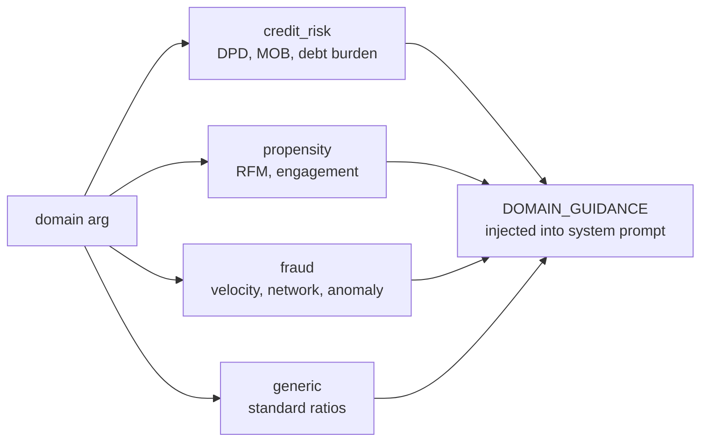

### Tools

| Tool | Mục đích |
|---|---|
| `create_interaction` | Tạo cột mới qua expression (`df['a'] / df['b']`) — capture median fill |
| `encode_categorical` | Encode 1 cột (label/onehot) — capture encoder |
| `encode_all_categorical` | Encode toàn bộ object cols cùng lúc (preferred) — capture batch |
| `correlation_analysis` | Pearson corr tới target (log only, no transform) |
| `select_top_features` | Giữ top-K theo `f_classif` / `f_regression` — capture selected list |

### Action order (rule)

```
encode_all_categorical → create_interaction(s) → correlation_analysis → select_top_features
```

Nếu LLM bỏ qua thứ tự (vd. select trước encode), các cột object sẽ bị loại oan vì SelectKBest không score được.

### Output

Intermediate `engineered_*.parquet` ghi vào `TMP_DIR` và xoá sau khi pipeline kết thúc (giống Agent 1).

**Persisted vào `RUN_DIR`** (cả 2 mode):
- `feature_engineer_report.json` — forward `entity_id_col`, `composite_key_cols`, `target_column`, `feature_spec` (serialized)
- `pipeline_process_feature_engineer.py` — script standalone replay FeatureSpec
- `feature_spec.pkl` — sidecar chứa fitted `LabelEncoder` objects (không embed được inline)

---

## 7. Agent 3 — TrainModel

**Vai trò**: AutoML pipeline đầy đủ — chọn estimator, fine-tune, lọc feature theo 5 tầng, train final + đánh giá đa split, detect overfit.

### Entry points

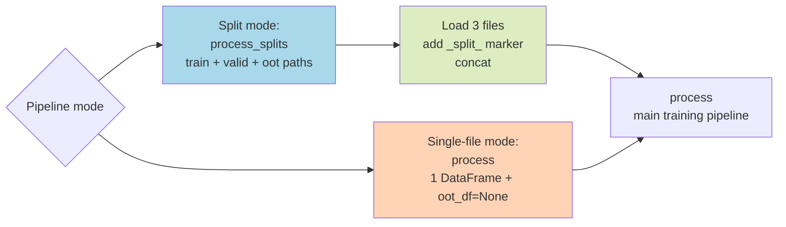

**Lưu ý**: `_split_` marker chỉ tồn tại **bên trong Agent 3** (không xuyên Agent 1+2 như kiến trúc cũ). Marker được Agent 3 tự gán khi concat 3 file, rồi `_tool_split_data` đọc marker để reconstruct splits exactly.

### Sơ đồ hoạt động tổng quan

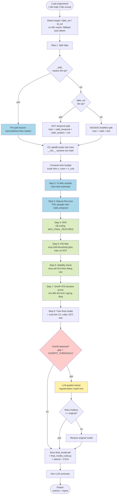

### Step 1 — Data Split chi tiết

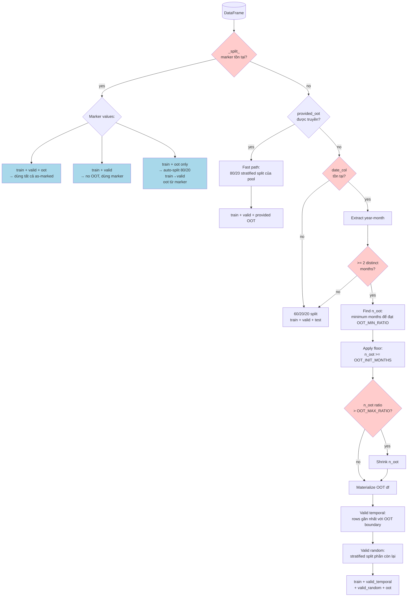

### Steps 2-3 — FLAML → Optuna

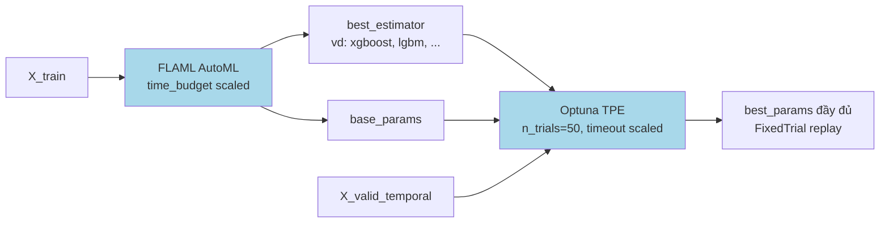

### Steps 4-7 — Feature Selection 5 tầng

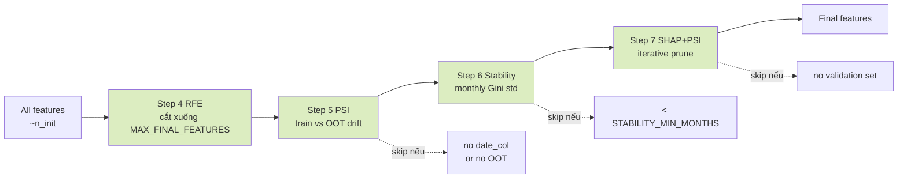

### Step 7 — SHAP+PSI Iterative Prune chi tiết


### Step 8 — Overfitting Detection & Retrain

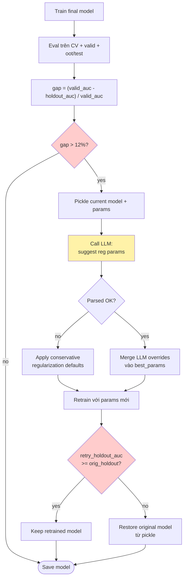

### Tools nội bộ

| Tool | Mục đích |
|---|---|
| `_tool_split_data` | Split (pre-split marker / provided OOT / OOT temporal / 60-20-20 fallback) |
| `_tool_run_flaml` | FLAML AutoML chọn estimator |
| `_tool_run_optuna` | Fine-tune hyperparams |
| `_tool_run_rfe` | RFE / RFECV feature selection |
| `_tool_run_psi_filter` | Drop feature theo PSI drift |
| `_tool_run_stability_check` | Drop feature theo monthly Gini std |
| `_tool_shap_psi_prune` | Iterative SHAP+PSI prune |
| `_tool_train_final_model` | Train final + eval đa split |

### Output (persisted vào `RUN_DIR` = `outputs/YYYY-MM-DD/run_NN/`)

| File | Mô tả |
|---|---|
| `final_model.pkl` | model + cat_encoders + feature_cols + target |
| `final_model_code.py` | Standalone inference code |
| `pipeline_process_train_model.py` | Bản copy của `final_model_code.py` dưới naming `pipeline_process_*` cho consistent với Agent 1+2 |
| `model_trainer_report.json` | JSON report đầy đủ |
| `psi_report.csv` | PSI score từng feature |
| `stability_report.csv` | Mean + std Gini theo tháng |
| `shap_psi_prune_log.csv` | Log từng step pruning |
| `final_report.md` + `agent_execution.log` | Markdown report tổng + execution log |

---

## 8. Spec replay — fit-on-train + transform-on-valid/oot

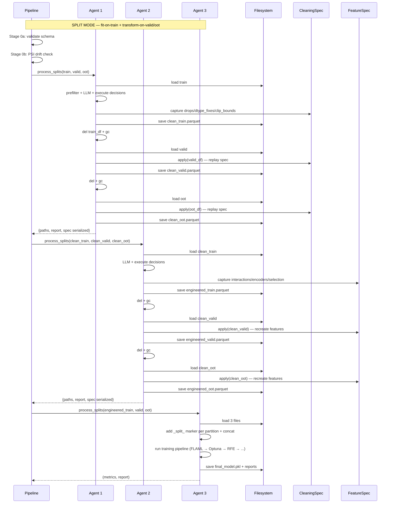

**Memory profile**: ở mỗi thời điểm chỉ có 1 partition trong RAM (Agent 1+2). Agent 3 concat 3 file → cần RAM cho toàn bộ data, nhưng đây là điểm bắt buộc vì FLAML/Optuna/CV cần tất cả slices để compute metrics.

**Tối ưu RAM tại Agent 3** (`_fit_prepare_X`):

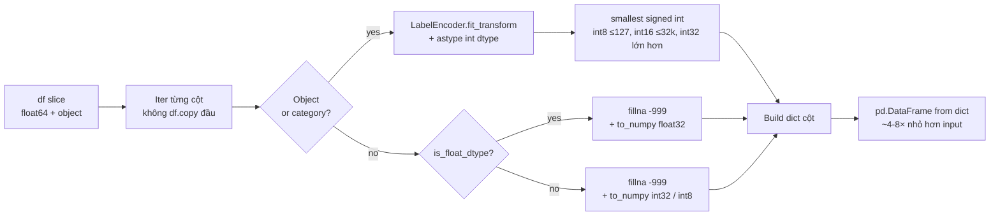

Benchmark (50k × 1400 mixed): 1.82 GB → 190 MB (≈9.6×). Cho case 100k × 1455 features hỗn hợp, alloc int64 matrix ban đầu 1.08 GB → ~150-450 MB sau downcast tùy tỉ lệ cat/num.

**Joblib temp folder**: Khi FLAML / sklearn dùng `n_jobs>1`, joblib stage X_train ra `.pkl` cho worker memory-map. `config.py` auto-set `JOBLIB_TEMP_FOLDER=tempfile.gettempdir()` (Linux: `/tmp`, Windows: `%TEMP%`) ngay khi import — tránh `BrokenProcessPool: FileNotFoundError` trên Docker (`/dev/shm` mặc định 64 MB). User override qua `.env`.

---

## 9. Replay bundle — chạy lại một run ở môi trường khác

Mỗi run ghi 6 file đủ để tái lập toàn trình (split → transform → retrain | score).
Chi tiết đầy đủ: [replay.md](replay.md).

```mermaid
sequenceDiagram
    participant U as User
    participant R as replay_pipeline.py
    participant M as replay_manifest.json
    participant S as split_assignment.parquet
    participant SP as cleaning_spec.pkl<br/>feature_spec.pkl
    participant A3 as TrainModelAgent

    U->>R: replay_pipeline.py <raw> --mode retrain
    R->>M: đọc quyết định đã chốt<br/>(estimator, best_params, final features)
    R->>S: join theo key + _key_occ_<br/>sort theo _split_pos_
    Note over R,S: dựng lại ĐÚNG partition + ĐÚNG thứ tự dòng
    R->>SP: CleaningSpec.apply (mọi partition)<br/>+ apply_row_ops (chỉ train)
    R->>SP: FeatureSpec.apply
    R->>A3: replay_fit(...) — bỏ FLAML/Optuna/RFE/PSI/SHAP
    A3-->>R: metrics
    R->>M: so với expected_metrics
    R-->>U: "Reproduced exactly" hoặc chỉ ra chặng nào sai
```

`--mode score` bỏ bước split và `replay_fit`, chỉ load `final_model.pkl` để chấm điểm dữ liệu mới.

---

## 10. LLM Fallback Strategy

Project hỗ trợ **2 backend** chọn qua env var `LLM_BACKEND`. Mỗi backend có chiến lược khác nhau:

```mermaid
flowchart LR
    Env[LLM_BACKEND env var] --> L{legacy?}
    L -->|yes default| Legacy[3-tier app-level fallback<br/>proxy + OpenAI + Claude]
    L -->|no - gateway| Gateway[Single source<br/>LiteLLM gateway only<br/>gateway tự xử lý failover]

    style Legacy fill:#ffd3b6
    style Gateway fill:#dcedc1
```

### Gateway backend (`LLM_BACKEND=gateway`)

Mỗi `call_llm()` đi thẳng tới gateway, KHÔNG có app-level fallback (gateway tự xử lý nội bộ):

```mermaid
flowchart TD
    Call[call_llm prompt] --> Route{Effort level<br/>+ prompt size}
    Route -->|low/short| H[Haiku tier]
    Route -->|medium/short| H
    Route -->|medium/long| S[Sonnet tier]
    Route -->|high/short| S
    Route -->|high/long| O[Opus tier]

    H --> GW[ANTHROPIC_BASE_URL<br/>via anthropic SDK]
    S --> GW
    O --> GW

    GW --> Retry{Retryable<br/>error?}
    Retry -->|yes| Backoff[Exponential backoff<br/>up to LLM_MAX_RETRIES]
    Backoff --> GW
    Retry -->|no| Done([Return / raise])

    style GW fill:#dcedc1
```

### Legacy backend (`LLM_BACKEND=legacy`, default)

Mỗi `call_llm()` đi qua chain 4 bước:

```mermaid
flowchart TD
    Call[call_llm prompt] --> Route{"Prompt length<br/>> MODEL_ROUTING_THRESHOLD?"}
    Route -->|yes| Cloud[Use CLOUD_MODEL]
    Route -->|no| Local[Use LOCAL_MODEL]

    Cloud --> P1[Try: LiteLLM proxy]
    Local --> P1

    P1 --> S1{Success?}
    S1 -->|yes| Done([Return result])
    S1 -->|no| Conn{Connection<br/>error?}

    Conn -->|yes| HasKey1{OPENAI_API_KEY<br/>set?}
    Conn -->|no| Swap[Try: swap proxy model<br/>local→cloud / cloud→local]

    Swap --> S2{Success?}
    S2 -->|yes| Done
    S2 -->|no| HasKey1

    HasKey1 -->|yes| OAI[Try: OpenAI direct]
    HasKey1 -->|no| CLD

    OAI --> S3{Success?}
    S3 -->|yes| Done
    S3 -->|no| CLD[Try: Claude direct<br/>last resort]

    CLD --> S4{Success?}
    S4 -->|yes| Done
    S4 -->|no| Fail([Raise])

    style P1 fill:#a8d8ea
    style Swap fill:#a8d8ea
    style OAI fill:#ffd3b6
    style CLD fill:#dcedc1
```

Mỗi attempt còn có **retry exponential backoff** cho lỗi rate-limit (429) và server (5xx), với `LLM_MAX_RETRIES=3`, base delay `LLM_RETRY_DELAY=2s`.

---

## 11. Smart Excel Reader

Pandas chọn Excel engine theo **extension** (`openpyxl` cho `.xlsx`, `xlrd` cho `.xls`). Khi file bị đặt sai extension (rất phổ biến — file `.xls` rename thành `.xlsx`), engine sai sẽ raise lỗi cryptic như "Can't find workbook in OLE2 compound document".

`BaseAgent._read_excel_smart` sniff 8 byte đầu để chọn engine đúng:

```mermaid
flowchart TD
    Path[File path] --> Read[Read first 8 bytes]
    Read --> Magic{Magic bytes}

    Magic -->|"50 4B 03 04"| ZIP[ZIP container<br/>= .xlsx/.xlsm]
    Magic -->|"D0 CF 11 E0 A1 B1 1A E1"| OLE[OLE2 compound<br/>= .xls]
    Magic -->|other| Bad[Raise RuntimeError<br/>chỉ ra 4 byte đầu]

    ZIP --> EngA["Engine: openpyxl<br/>fallback = xlrd"]
    OLE --> EngB["Engine: xlrd<br/>fallback = openpyxl"]

    EngA --> Try[pd.read_excel<br/>với engine]
    EngB --> Try

    Try --> Result{Success?}
    Result -->|yes| Done([Return DataFrame])
    Result -->|ImportError| Fallback[Try other engine]
    Result -->|other Exception| RealError[Raise with context:<br/>file may be corrupt/encrypted]

    Fallback --> Try

    style Bad fill:#ffcccc
    style RealError fill:#ffcccc
```

Wired vào `BaseAgent.load_dataframe` (raw data files) và `FeatureEngineerAgent._load_col_descriptions` (col descriptions).

---

## 12. Protected Columns — bảo vệ key columns xuyên suốt

```mermaid
flowchart TD
    Input[Input từ CLI<br/>--entity-id, --keys, --target] --> A1
    A1[Agent 1<br/>auto-detect nếu thiếu] -->|report.entity_id_col<br/>report.composite_key_cols<br/>report.target_column| A2
    A2[Agent 2<br/>inherit + add date_col] -->|protected forwarded| A3
    A3[Agent 3<br/>inherit + add id_col + date_col<br/>cho OOT split]

    A1 -.bảo vệ trong.-> A1G[drop_column / clip / dtype fix]
    A2 -.bảo vệ trong.-> A2G[interaction expressions<br/>encode / select_top<br/>+ post-select restoration]
    A3 -.dùng trong.-> A3G[OOT split + stability check]

    style A1G fill:#ffcccc
    style A2G fill:#ffcccc
    style A3G fill:#ffcccc
```

---

## 13. Output Folder Map

Sau khi pipeline chạy xong, `outputs/` chứa **các file phụ thuộc mode**:

### Split mode (`--valid` / `--oot` được set)

```
outputs/
├── clean_train.parquet              ◄── Agent 1: train fit + LLM + spec capture
├── clean_valid.parquet              ◄── Agent 1: spec replay, no row drop
├── clean_oot.parquet                ◄── Agent 1: spec replay, no row drop
│
├── engineered_train.parquet         ◄── Agent 2: train fit
├── engineered_valid.parquet         ◄── Agent 2: FeatureSpec replay
├── engineered_oot.parquet           ◄── Agent 2: FeatureSpec replay
│
├── data_cleaner_report.json         ◄── Agent 1 + cleaning_spec serialized
├── feature_engineer_report.json     ◄── Agent 2 + feature_spec serialized
├── model_trainer_report.json        ◄── Agent 3 metrics + feature pipeline
│
├── psi_report.csv                   ◄── PSI drift per feature (Agent 3 step 5)
├── stability_report.csv             ◄── Monthly Gini stats
├── shap_psi_prune_log.csv           ◄── Pruning step-by-step log
│
├── final_model.pkl                  ◄── Model + encoders (joblib)
├── final_model_code.py              ◄── Standalone inference script
│
├── final_report.md                  ◄── Full markdown report
└── agent_execution.log              ◄── Plain-text execution log
```

### Single-file mode (no `--valid` / `--oot`)

```
outputs/
├── clean_data.parquet               ◄── Agent 1 output (1 file)
├── engineered_data.parquet          ◄── Agent 2 output (1 file)
│
├── data_cleaner_report.json
├── feature_engineer_report.json
├── model_trainer_report.json
│
├── psi_report.csv                   (chỉ nếu Agent 3 split có OOT)
├── stability_report.csv             (chỉ nếu Agent 3 split có date_col)
├── shap_psi_prune_log.csv
│
├── final_model.pkl
├── final_model_code.py
├── final_report.md
└── agent_execution.log
```

---

## 14. End-to-end test suite

`_e2e_check.py` chạy 6 test với mock LLM (không gọi network), verify toàn bộ flow:

| # | Test | Verify |
|---|---|---|
| 1 | SINGLE-FILE mode | Pipeline chạy đến hết, có `cv_auc_mean`, model artifact tồn tại |
| 2 | SPLIT mode | 3 file clean + 3 file engineered tồn tại, valid/oot row count preserved, schema parity giữa 3 file |
| 3 | SPLIT + `--sample-ratio 0.5` + `--no-prefilter`-off | Train sampled ~50%, junk cols (constant/null/dominant) drop từ train được replay sang valid/oot |
| 4 | Schema validation: missing target | RAISE trước Agent 1, không có file output |
| 5 | Schema unit: dtype mismatch + extra col + missing col → WARN; missing entity_id / composite_key → RAISE | Đúng severity classification |
| 6 | Distribution drift: train↔valid heavily shifted → WARN với cột bị shift; train↔oot stable → no false positive | PSI threshold đúng + top-N report đúng |

```powershell
python _e2e_check.py
```

---

## 15. Tham chiếu nhanh

- [README.md](../README.md) — Quick start + CLI examples
- [docs/awareness-pattern.md](awareness-pattern.md) — Agentic pattern (Plan-Execute + Awareness)
- [docs/config_params.md](config_params.md) — Reference toàn bộ ~75 config params
- [pipeline.py](../pipeline.py) — Orchestrator chính + Stage 0a/0b
- [Agents/BaseAgent/base_agent.py](../Agents/BaseAgent/base_agent.py) — LLM call + tool execution + smart Excel reader
