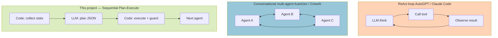
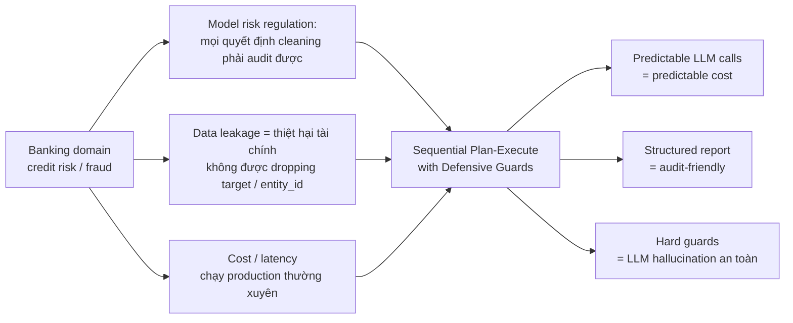

# Awareness Pattern — Multi-Agent AutoML

Tài liệu phân tích pattern thiết kế của các agents trong project: thuộc loại nào, dùng những lớp awareness gì, và vì sao chọn approach này.

---

## 1. Tổng thể — Pattern: "Stats-Grounded LLM-Planner + Code-Executor"

Có 1 project khác dùng pattern ReAct loop (think → act → observe → think) như AutoGPT / Claude Code tuy nhiên không kiểm soát được đầu ra từng bước, và kết quả cuối nên propose --> Pipeline:

```
┌─────────────────────────────────────────────────────────────────────┐
│                                                                     │
│  Code thu thập STATS (facts)   ─►   LLM ra DECISIONS (plan)          │
│  ───────────────────────────         ──────────────────────          │
│  • inspect_metadata                  • Mù về data thật                │
│  • check_pk_uniqueness               • Có context đầy đủ              │
│  • detect_outliers                   • Output JSON action list        │
│  • check_label_quality                                                │
│                                                                     │
│                                  ▼                                  │
│                                                                     │
│                       Code EXECUTE + GUARD                           │
│                       ───────────────────                           │
│                       • Parse JSON                                  │
│                       • Hard-coded checks                           │
│                       • Block nếu LLM sai                           │
│                       • Log mọi quyết định                          │
│                                                                     │
└─────────────────────────────────────────────────────────────────────┘
```

**Đặc trưng cốt lõi**:
- LLM chỉ được gọi **1-2 lần** mỗi agent — không loop nhiều bước
- LLM nhận **stats thật** đã được code chuẩn bị — không phải tự inspect data (nhằm kiểm soát những dữ liệu LLM gọi là không bịa)
- LLM output **JSON cố định** — action space giới hạn, không free-form
- Code **verify** mọi action trước khi execute — không tin LLM tuyệt đối

---

## 2. Các lớp Awareness có trong pipeline

Agent của project này thể hiện **12 lớp awareness**, từ low-level (data) đến high-level (drift, overfit):

| # | Awareness | Cách triển khai | Code reference |
|---|---|---|---|
| 1 | **Data-awareness** | Thu thập statistics REAL trước khi gọi LLM, không để LLM tự đoán | `_collect_label_stats`, `_collect_pk_stats`, `_collect_outlier_stats`, `_analyze_features` |
| 2 | **Domain-awareness** | Inject domain knowledge vào system prompt | `FeatureEngineerAgent._DOMAIN_GUIDANCE` (credit_risk / propensity / fraud / generic) |
| 3 | **Lineage-awareness** | Agent sau biết agent trước đã làm gì qua `previous_report` | `report.entity_id_col`, `report.composite_key_cols` forward giữa 3 agents |
| 4 | **Protected-state awareness** | Set cột "không bao giờ được động vào" | `_pk_protected_cols` = entity_id ∪ composite_key ∪ target |
| 5 | **Tool-awareness** | Tool descriptions inject vào prompt | `ToolRegistry.get_tool_descriptions()` |
| 6 | **Guard / Constraint-awareness** | Hard-coded checks sau LLM decision, override nếu sai | Block `drop_column` nếu null_rate < threshold AND not constant AND not all-unique |
| 7 | **Cost-awareness** | Routing model theo prompt length | `MODEL_ROUTING_THRESHOLD` → local/cloud model |
| 8 | **Failure-awareness** | Backend-dependent + exponential retry. Legacy = 3-tier app fallback; Gateway = single source (gateway tự handle failover) | Legacy: LiteLLM → OpenAI direct → Claude direct. Gateway: ANTHROPIC_BASE_URL only |
| 9 | **Resource-awareness** | Dynamic time budget + GPU auto-detect + sampling | `_compute_time_budget(n_rows, n_cols)`, `FLAML_MAX_ROWS` |
| 10 | **Temporal-awareness** | OOT split theo date, valid_temporal cho Optuna tránh leak | `_tool_split_data` với date_col |
| 11 | **Drift-awareness** | PSI filter train vs OOT | `_tool_run_psi_filter` |
| 12 | **Stability + Overfit-awareness** | Monthly Gini std + so sánh valid vs holdout gap, tự retrain | `_tool_run_stability_check`, `_check_overfitting` → `_get_antioverfitting_params` |

---

## 3. Đặc trưng nổi bật

### a. "Trust but verify" — LLM được tin nhưng có rào chắn

Ví dụ trong [agent_data_cleaner.py](../Agents/DataCleaner/agent_data_cleaner.py):

```python
if action_type == "drop_column":
    if column in self._pk_protected_cols:    # Guard 1
        self.logger.log("SKIP", f"PK/key column — drop blocked")
        continue

    null_rate = self.df[column].isnull().mean()
    is_constant = self.df[column].dropna().nunique() <= 1
    is_all_unique = self.df[column].nunique() == len(self.df) and self.df[column].notna().all()

    if not is_constant and not is_all_unique and null_rate <= Config.NULL_DROP_THRESHOLD:
        self.logger.log("BLOCK", f"null_rate {null_rate:.1%} ≤ threshold — drop blocked")
        continue                              # Guard 2

    self.df = self.execute_tool("drop_column", df=self.df, col=column)
```

→ Đây là **"Defensive Execution Pattern"**: LLM có thể sai / hallucinate, code phải verify.

### b. Fact-grounded prompts — chống hallucination

LLM **không bao giờ** được hỏi chung chung "hãy làm sạch data này". Mà là:

```
Đây là metadata: {shape, dtypes, nulls, duplicates}
Đây là format issues: {numeric_stored_as_object: [...]}
Đây là outlier stats: {col_X: {iqr, outlier_pct}}
Đây là label quality: {imbalance_ratio: 22, ...}

Quyết định cleaning actions trong JSON format từ tập tool dưới đây:
- drop_column, drop_duplicates, clip_outliers, fix_column_dtype, ...
```

→ LLM chỉ phải **chọn** từ tập action có sẵn, dựa trên **số liệu thật**.

### c. Inter-agent contract qua JSON report

```python
# Agent 1 output
report = {
    "entity_id_col": "customer_id",
    "composite_key_cols": ["customer_id", "snap_dt"],
    "target_column": "label",
    "actions_taken": [...],
    "summary": "...",
}
# → forward sang Agent 2 + Agent 3 qua Handoff
```

Không phải "chat" giữa agents (autogen-style), mà là **structured handoff** — predictable, debuggable.

### d. Sequential Choreography, KHÔNG phải Conversational Orchestration

| Khía cạnh | Pattern hiện tại (Sequential) | Pattern khác (Conversational) |
|---|---|---|
| Topology | A1 → A2 → A3 (linear) | A1 ↔ A2 ↔ A3 (mesh chat) |
| Mỗi agent | Self-contained, không hỏi lại | Có thể delegate / ask peer |
| Số LLM call | Cố định (1-2 per agent) | Không xác định trước |
| Cost / latency | Thấp, predictable | Cao, biến động |
| Debug | Dễ — mỗi step có report | Khó — phải trace conversation |
| Phù hợp | **Production pipeline** | **Exploratory / agentic tasks** |

→ Pattern hiện tại đánh đổi flexibility lấy **predictability + cost** — phù hợp pipeline production trong banking / credit risk.

---

## 4. Phân loại trong taxonomy agent design

| Khung phân loại | Vị trí của agents trong project |
|---|---|
| **Autonomy level** | **Bounded / Constrained agent** — không tự ý loop, action space cố định |
| **Tool use style** | **Structured tool calling** — JSON spec, không free-form |
| **Reasoning pattern** | **Plan-Execute** — kế hoạch một lần rồi thực thi, KHÔNG phải ReAct |
| **Multi-agent topology** | **Sequential pipeline** (linear), KHÔNG phải mesh / hub-spoke |
| **LLM role** | **LLM-as-Decision-Maker** + Code-as-Tool-Executor (hybrid) |
| **Safety pattern** | **Guard-rail / Defensive execution** — hard checks override LLM |
| **Domain integration** | **Prompt-injected domain expertise** (qua `_DOMAIN_GUIDANCE`) |
| **State management** | **Structured handoff via JSON report** (không phải shared memory) |
| **Failure tolerance** | **Multi-tier fallback** (proxy → OpenAI → Claude) |

---

## 5. So sánh với các pattern phổ biến khác



| Pattern | Khi nào dùng | Khi nào KHÔNG dùng |
|---|---|---|
| **ReAct loop** | Task mở, không biết trước cần bao nhiêu bước | Production pipeline, latency-sensitive |
| **Conversational multi-agent** | Cần collaborate / negotiate giữa role khác nhau | Cần predictable cost + audit trail |
| **Sequential Plan-Execute (project này)** | **Pipeline có thứ tự rõ + cần guards + cost control** | Task quá mơ hồ, action space không xác định trước |

---

## 6. Tại sao chọn pattern này cho AutoML banking?

Domain banking / credit risk có **3 ràng buộc cứng**:



**Tóm lại**: Pattern này có thể gọi là **"Multi-Agent Stats-Grounded Plan-Execute with Defensive Guards"** — một approach **production-oriented**: LLM được dùng cho phần **judgment** (chọn hành động phù hợp với data), còn phần **execution** vẫn do code tin cậy đảm nhận. Đặc biệt phù hợp domain có **rủi ro cao** nơi LLM hallucination có thể gây thiệt hại — nên cần guards và explicit protected state xuyên suốt.

---

## 7. Trade-off của pattern này

| Mất | Được |
|---|---|
| Không tự thích nghi với task mới (action space cố định) | Predictable cost + latency |
| Không "thông minh" như agent loop (1 lần ra quyết định) | An toàn — không runaway loop |
| Cần code nhiều guard logic | LLM hallucination không phá data |
| Khó add bước mới (phải code thêm tool) | Audit trail rõ ràng, dễ debug |
| Phụ thuộc vào chất lượng stats được feed | LLM không cần inspect data → tiết kiệm token |

---

## 8. Tham chiếu

- [README.md](../README.md) — Quick start
- [docs/architecture.md](architecture.md) — Visual walkthrough toàn pipeline
- [docs/config_params.md](config_params.md) — Reference config params
- [Agents/BaseAgent/base_agent.py](../Agents/BaseAgent/base_agent.py) — `call_llm`, `execute_tool`, `ToolRegistry`
- [Agents/DataCleaner/agent_data_cleaner.py](../Agents/DataCleaner/agent_data_cleaner.py) — Ví dụ rõ nhất về defensive guards
