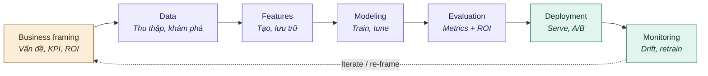

# ML Model Lifecycle 

> Khung tham chiếu cho ML model development trong banking 

---

## 1. Overview

ML lifecycle thường được vẽ như một cycle (` business framing --> data → model → deploy`). Mỗi lần monitoring phát hiện drift hoặc performance suy giảm, quyết định đúng nên là "kiểm tra lại assumption ban đầu có còn đúng không" sau đó "retrain" và lặp lại cycle khác.

Đây là cycle 7 giai đoạn:

Ba nhóm màu phản ánh ba bản chất công việc khác nhau:

| Màu | Stage | Bản chất |
|---|---|---|
| 🟡 Amber | Business framing | Ngôn ngữ stakeholder, kinh doanh, không có code |
| 🟣 Purple | Data, Features, Modeling, Evaluation | Iteration nội bộ trong dev environment |
| 🟢 Teal | Deployment, Monitoring | Model gặp dữ liệu thật và hành vi thật, thường trên live |

---

